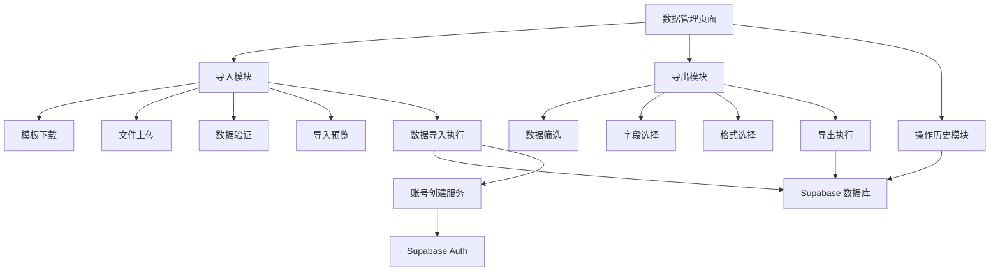
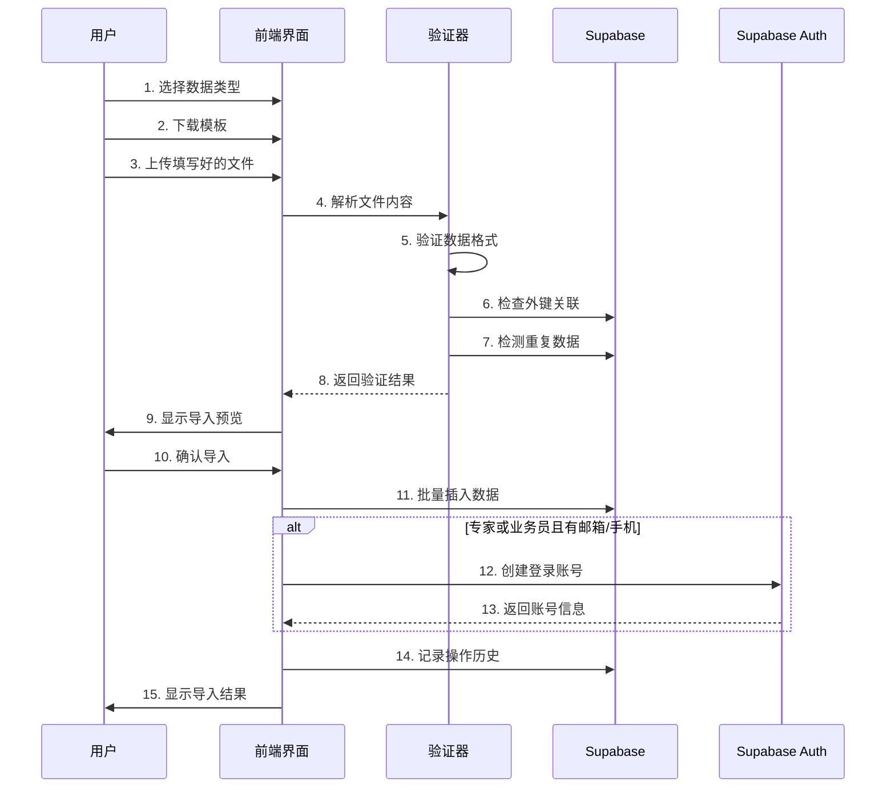
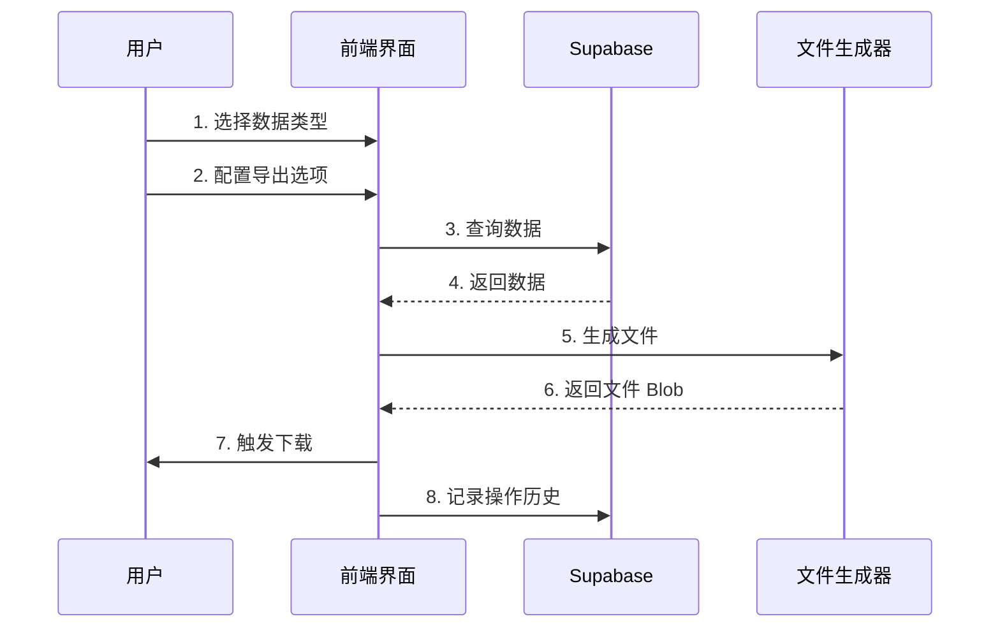

# 数据管理功能设计文档

## 概述

数据管理功能是培训管理系统的核心管理模块，为管理员提供批量导入和导出培训课程、专家、客户、业务员、培训场次等核心业务数据的能力。该功能通过标准化的 Excel 模板、智能数据验证、导入预览和错误处理机制，大幅提升数据管理效率，降低人工录入成本和错误率。

## 架构设计

### 整体架构



### 技术栈

- **前端框架**: React 18 + TypeScript
- **UI 组件**: Tailwind CSS + Lucide Icons + Framer Motion
- **状态管理**: React Context + useState/useEffect
- **路由**: React Router v6
- **数据处理**: 
  - Excel 处理: SheetJS (xlsx)
  - CSV 处理: PapaParse
  - PDF 生成: jsPDF + jsPDF-AutoTable
- **后端服务**: Supabase (PostgreSQL + Auth + RLS)
- **文件上传**: 浏览器原生 File API
- **数据验证**: 自定义验证器 + Zod (可选)

## 组件设计

### 页面结构


```
DataManagement/
├── Header (页面标题和说明)
├── TabNavigation (导入/导出切换)
├── ImportTab
│   ├── DataTypeSelector (数据类型选择)
│   ├── TemplateDownload (模板下载按钮)
│   ├── FileUpload (文件上传区域)
│   ├── ValidationResults (验证结果展示)
│   ├── ImportPreview (导入预览表格)
│   └── ImportActions (确认/取消按钮)
├── ExportTab
│   ├── DataTypeSelector (数据类型选择)
│   ├── FormatSelector (格式选择)
│   ├── RangeSelector (范围选择)
│   ├── FieldSelector (字段选择)
│   ├── FilterOptions (筛选条件)
│   └── ExportActions (导出按钮)
└── OperationHistory (操作历史记录)
```

### 核心组件

#### 1. DataManagement (主页面组件)

**职责**: 
- 管理整体页面状态
- 协调导入导出模块
- 处理权限验证

**Props**: 无

**State**:
```typescript
interface DataManagementState {
  activeTab: 'import' | 'export';
  selectedDataType: DataType;
  loading: boolean;
  error: string | null;
}

type DataType = 'courses' | 'experts' | 'customers' | 'salespersons' | 'training_sessions';
```

#### 2. ImportModule (导入模块)

**职责**:
- 处理文件上传
- 执行数据验证
- 显示导入预览
- 执行数据导入

**State**:
```typescript
interface ImportState {
  uploadedFile: File | null;
  validationStatus: 'idle' | 'validating' | 'success' | 'error';
  validationResults: ValidationResult[];
  previewData: any[];
  importProgress: number;
  duplicateStrategy: 'skip' | 'overwrite' | 'keep_both';
}

interface ValidationResult {
  row: number;
  column: string;
  error: string;
  severity: 'error' | 'warning';
}
```


#### 3. ExportModule (导出模块)

**职责**:
- 提供导出配置选项
- 执行数据查询和筛选
- 生成导出文件

**State**:
```typescript
interface ExportState {
  format: 'excel' | 'csv' | 'pdf';
  range: 'all' | 'filtered' | 'custom';
  dateRange: [Date, Date] | null;
  selectedFields: string[];
  filters: Record<string, any>;
  exportProgress: number;
}
```

#### 4. FileUpload (文件上传组件)

**职责**:
- 提供拖拽和点击上传
- 验证文件类型和大小
- 显示上传进度

**Props**:
```typescript
interface FileUploadProps {
  onFileSelect: (file: File) => void;
  acceptedFormats: string[];
  maxSize: number; // MB
  disabled?: boolean;
}
```

#### 5. ImportPreview (导入预览组件)

**职责**:
- 以表格形式展示待导入数据
- 高亮显示错误和警告
- 标注重复数据和新建账号

**Props**:
```typescript
interface ImportPreviewProps {
  data: any[];
  validationResults: ValidationResult[];
  duplicates: number[];
  newAccounts: number[];
  columns: ColumnDefinition[];
}

interface ColumnDefinition {
  key: string;
  label: string;
  required: boolean;
}
```

## 数据模型

### 模板定义


#### 培训课程模板

```typescript
interface CourseTemplate {
  id: string;                    // 必填
  name: string;                  // 必填
  description?: string;
  duration?: number;             // 小时
  price?: number;                // 元
  category?: string;             // 技术培训|管理培训|销售培训|其他
  expert_id?: number;
}
```

#### 专家信息模板

```typescript
interface ExpertTemplate {
  name: string;                  // 必填
  title?: string;
  field?: string;
  experience?: string;
  rating?: number;               // 0.00-5.00
  courses?: string;              // 逗号分隔
  location?: string;
  available?: boolean;           // 默认 true
  bio?: string;
  past_sessions?: number;
  total_participants?: number;
  email?: string;                // 用于创建账号
  phone?: string;                // 用于创建账号
}
```

#### 客户信息模板

```typescript
interface CustomerTemplate {
  name: string;                  // 必填
  phone: string;                 // 必填
  email?: string;
  company?: string;
  position?: string;
  location?: string;
  status?: string;               // 潜在客户|意向客户|成交客户|流失客户
  salesperson_id?: string;       // UUID
  salesperson_name?: string;
  follow_up_status?: string;     // 待跟进|跟进中|已成交|已放弃
  last_contact?: string;         // YYYY-MM-DD
  tags?: string;                 // 逗号分隔
}
```

#### 业务员信息模板

```typescript
interface SalespersonTemplate {
  name: string;                  // 必填
  phone: string;                 // 必填
  department?: string;
  position?: string;
  email?: string;                // 用于创建账号
  join_date?: string;            // YYYY-MM-DD
  status?: string;               // pending|active|rejected，默认 pending
  team?: string;
}
```


#### 培训场次模板

```typescript
interface TrainingSessionTemplate {
  name: string;                  // 必填
  date: string;                  // 必填，YYYY-MM-DD
  end_time: string;              // 必填，HH:MM
  end_date?: string;             // YYYY-MM-DD，默认使用 date
  start_time?: string;           // HH:MM
  participants?: number;
  expert_id?: number;
  expert_name?: string;
  area?: string;
  revenue?: number;
  status?: string;               // 计划中|进行中|已完成|已取消
  rating?: number;               // 0.00-5.00
  salesperson_id?: number;
  salesperson_name?: string;
  course_id?: string;
  course_description?: string;
  capacity?: number;             // 默认 30
}
```

### 数据库映射

#### 表结构映射关系

| 模板类型 | 数据库表 | 主键 | 外键关系 |
|---------|---------|------|---------|
| 培训课程 | courses | id (text) | expert_id → experts.id |
| 专家信息 | experts | id (serial) | user_id → user_profiles.id |
| 客户信息 | customers | id (serial) | salesperson_id → user_profiles.id |
| 业务员信息 | salespersons | id (serial) | user_id → user_profiles.id |
| 培训场次 | training_sessions | id (serial) | expert_id → experts.id<br>salesperson_id → salespersons.id<br>course_id → courses.id |

## 业务逻辑设计

### 导入流程




### 数据验证规则

#### 通用验证规则

```typescript
interface ValidationRule {
  field: string;
  type: 'required' | 'format' | 'range' | 'foreign_key' | 'unique';
  validator: (value: any, row: any) => ValidationError | null;
  message: string;
}

// 示例：手机号验证
const phoneValidator: ValidationRule = {
  field: 'phone',
  type: 'format',
  validator: (value) => {
    const phoneRegex = /^1[3-9]\d{9}$|^\+\d{1,3}\d{10,14}$/;
    if (!phoneRegex.test(value)) {
      return { error: '手机号格式不正确' };
    }
    return null;
  },
  message: '手机号必须是11位数字或带国际区号'
};

// 示例：邮箱验证
const emailValidator: ValidationRule = {
  field: 'email',
  type: 'format',
  validator: (value) => {
    const emailRegex = /^[^\s@]+@[^\s@]+\.[^\s@]+$/;
    if (value && !emailRegex.test(value)) {
      return { error: '邮箱格式不正确' };
    }
    return null;
  },
  message: '邮箱格式必须符合标准'
};

// 示例：外键验证
const expertIdValidator: ValidationRule = {
  field: 'expert_id',
  type: 'foreign_key',
  validator: async (value, row) => {
    if (!value && !row.expert_name) {
      return { error: '专家ID和专家姓名至少需要填写一个' };
    }
    if (value) {
      const exists = await checkExpertExists(value);
      if (!exists) {
        return { error: `专家ID ${value} 不存在` };
      }
    }
    return null;
  },
  message: '专家ID必须存在于系统中'
};
```

#### 数据类型特定验证

**培训课程**:
- id: 必填，唯一性检查
- name: 必填
- duration: 可选，正整数
- price: 可选，非负数
- category: 可选，枚举值验证
- expert_id: 可选，外键验证

**专家信息**:
- name: 必填
- rating: 可选，0.00-5.00 范围
- available: 可选，布尔值
- email/phone: 至少一个，格式验证
- past_sessions: 可选，非负整数
- total_participants: 可选，非负整数

**客户信息**:
- name: 必填
- phone: 必填，格式验证，唯一性检查（警告级别）
- email: 可选，格式验证
- salesperson_id/salesperson_name: 至少一个，外键验证
- status: 可选，枚举值验证
- follow_up_status: 可选，枚举值验证
- last_contact: 可选，日期格式验证

**业务员信息**:
- name: 必填
- phone: 必填，格式验证，唯一性检查
- email: 可选，格式验证，唯一性检查
- join_date: 可选，日期格式验证
- status: 可选，枚举值验证

**培训场次**:
- name: 必填
- date: 必填，日期格式验证
- end_time: 必填，时间格式验证
- end_date: 可选，日期格式验证，必须 >= date
- start_time: 可选，时间格式验证
- expert_id/expert_name: 至少一个，外键验证
- salesperson_id/salesperson_name: 至少一个，外键验证
- rating: 可选，0.00-5.00 范围
- capacity: 可选，正整数，默认 30


### 重复数据处理

#### 重复检测逻辑

```typescript
interface DuplicateCheckConfig {
  table: string;
  uniqueFields: string[];
  strategy: 'skip' | 'overwrite' | 'keep_both';
}

// 培训课程：基于 id
const courseDuplicateCheck: DuplicateCheckConfig = {
  table: 'courses',
  uniqueFields: ['id'],
  strategy: 'skip'
};

// 专家：基于 name（警告级别，允许同名）
const expertDuplicateCheck: DuplicateCheckConfig = {
  table: 'experts',
  uniqueFields: ['name'],
  strategy: 'keep_both'
};

// 客户：基于 phone（警告级别）
const customerDuplicateCheck: DuplicateCheckConfig = {
  table: 'customers',
  uniqueFields: ['phone'],
  strategy: 'skip'
};

// 业务员：基于 phone 或 email
const salespersonDuplicateCheck: DuplicateCheckConfig = {
  table: 'salespersons',
  uniqueFields: ['phone', 'email'],
  strategy: 'skip'
};

// 培训场次：基于 name + date（警告级别）
const trainingSessionDuplicateCheck: DuplicateCheckConfig = {
  table: 'training_sessions',
  uniqueFields: ['name', 'date'],
  strategy: 'keep_both'
};
```

#### 处理策略

1. **跳过 (skip)**: 
   - 检测到重复时，跳过该条记录
   - 在导入结果中标注为"已跳过"
   - 适用于：培训课程、客户、业务员

2. **覆盖 (overwrite)**:
   - 检测到重复时，更新现有记录
   - 保留原记录的 id 和 created_at
   - 更新其他所有字段
   - 适用于：需要批量更新数据的场景

3. **保留两者 (keep_both)**:
   - 检测到重复时，仍然插入新记录
   - 系统自动生成新的 id
   - 在导入结果中标注为"重复但已保留"
   - 适用于：专家（允许同名）、培训场次（允许同名同日期）

### 账号创建逻辑


#### 账号创建流程

```typescript
interface AccountCreationConfig {
  role: 'expert' | 'salesperson';
  usernameField: 'email' | 'phone';
  defaultPassword: string;
}

async function createAccountForImportedUser(
  userData: ExpertTemplate | SalespersonTemplate,
  role: 'expert' | 'salesperson'
): Promise<AccountCreationResult> {
  // 1. 确定用户名（优先邮箱）
  const username = userData.email || userData.phone;
  if (!username) {
    return { success: false, reason: '缺少邮箱或手机号' };
  }
  
  // 2. 检查账号是否已存在
  const existingUser = await supabase.auth.admin.getUserByEmail(username);
  if (existingUser) {
    return { success: false, reason: '账号已存在', userId: existingUser.id };
  }
  
  // 3. 创建 Auth 账号
  const { data: authUser, error: authError } = await supabase.auth.admin.createUser({
    email: userData.email || `${userData.phone}@temp.local`,
    phone: userData.phone,
    password: '123456',
    email_confirm: true,
    phone_confirm: true
  });
  
  if (authError) {
    return { success: false, reason: authError.message };
  }
  
  // 4. 创建 user_profile
  const { error: profileError } = await supabase
    .from('user_profiles')
    .insert({
      id: authUser.user.id,
      username: username,
      role: role,
      name: userData.name,
      department: role === 'salesperson' ? userData.department : undefined,
      status: 'active'
    });
  
  if (profileError) {
    // 回滚：删除 Auth 账号
    await supabase.auth.admin.deleteUser(authUser.user.id);
    return { success: false, reason: profileError.message };
  }
  
  return { 
    success: true, 
    userId: authUser.user.id,
    username: username
  };
}

interface AccountCreationResult {
  success: boolean;
  userId?: string;
  username?: string;
  reason?: string;
}
```

#### 账号创建批处理

```typescript
async function batchCreateAccounts(
  users: (ExpertTemplate | SalespersonTemplate)[],
  role: 'expert' | 'salesperson'
): Promise<BatchAccountCreationResult> {
  const results: AccountCreationResult[] = [];
  const successCount = { created: 0, skipped: 0, failed: 0 };
  
  for (const user of users) {
    const result = await createAccountForImportedUser(user, role);
    results.push(result);
    
    if (result.success) {
      successCount.created++;
    } else if (result.reason === '账号已存在') {
      successCount.skipped++;
    } else {
      successCount.failed++;
    }
    
    // 避免 API 限流，每创建 10 个账号暂停 1 秒
    if (successCount.created % 10 === 0) {
      await new Promise(resolve => setTimeout(resolve, 1000));
    }
  }
  
  return {
    results,
    summary: successCount,
    message: `成功创建 ${successCount.created} 个账号，跳过 ${successCount.skipped} 个已存在账号，失败 ${successCount.failed} 个`
  };
}
```


### 导出流程



#### 导出配置

```typescript
interface ExportConfig {
  dataType: DataType;
  format: 'excel' | 'csv' | 'pdf';
  range: 'all' | 'filtered' | 'custom';
  dateRange?: [Date, Date];
  selectedFields: string[];
  filters: Record<string, any>;
  sortBy?: string;
  sortOrder?: 'asc' | 'desc';
}

// 字段映射（数据库字段 -> 显示名称）
const fieldMappings: Record<DataType, Record<string, string>> = {
  courses: {
    id: '课程ID',
    name: '课程名称',
    description: '课程描述',
    duration: '时长（小时）',
    price: '价格（元）',
    category: '课程分类',
    expert_id: '授课专家ID',
    created_at: '创建时间'
  },
  experts: {
    id: '专家ID',
    name: '专家姓名',
    title: '职称',
    field: '专业领域',
    experience: '工作经验',
    rating: '评分',
    location: '所在地区',
    available: '是否可用',
    bio: '个人简介',
    past_sessions: '历史授课场次',
    total_participants: '累计参训人数'
  },
  // ... 其他数据类型的字段映射
};
```


### 文件生成

#### Excel 生成

```typescript
import * as XLSX from 'xlsx';

function generateExcelFile(data: any[], config: ExportConfig): Blob {
  // 1. 准备数据
  const mappedData = data.map(row => {
    const mappedRow: any = {};
    config.selectedFields.forEach(field => {
      const displayName = fieldMappings[config.dataType][field];
      mappedRow[displayName] = formatValue(row[field], field);
    });
    return mappedRow;
  });
  
  // 2. 创建工作簿
  const wb = XLSX.utils.book_new();
  const ws = XLSX.utils.json_to_sheet(mappedData);
  
  // 3. 设置列宽
  const colWidths = config.selectedFields.map(field => ({
    wch: Math.max(field.length, 15)
  }));
  ws['!cols'] = colWidths;
  
  // 4. 添加工作表
  XLSX.utils.book_append_sheet(wb, ws, '数据');
  
  // 5. 生成文件
  const excelBuffer = XLSX.write(wb, { bookType: 'xlsx', type: 'array' });
  return new Blob([excelBuffer], { 
    type: 'application/vnd.openxmlformats-officedocument.spreadsheetml.sheet' 
  });
}
```

#### CSV 生成

```typescript
import Papa from 'papaparse';

function generateCSVFile(data: any[], config: ExportConfig): Blob {
  // 1. 准备数据
  const mappedData = data.map(row => {
    const mappedRow: any = {};
    config.selectedFields.forEach(field => {
      const displayName = fieldMappings[config.dataType][field];
      mappedRow[displayName] = formatValue(row[field], field);
    });
    return mappedRow;
  });
  
  // 2. 转换为 CSV
  const csv = Papa.unparse(mappedData, {
    quotes: true,
    delimiter: ',',
    header: true
  });
  
  // 3. 添加 BOM 以支持中文
  const BOM = '\uFEFF';
  return new Blob([BOM + csv], { type: 'text/csv;charset=utf-8;' });
}
```

#### PDF 生成

```typescript
import jsPDF from 'jspdf';
import autoTable from 'jspdf-autotable';

function generatePDFFile(data: any[], config: ExportConfig): Blob {
  const doc = new jsPDF({
    orientation: 'landscape',
    unit: 'mm',
    format: 'a4'
  });
  
  // 1. 添加中文字体支持
  // doc.addFont('path/to/chinese-font.ttf', 'chinese', 'normal');
  // doc.setFont('chinese');
  
  // 2. 添加页眉
  doc.setFontSize(16);
  doc.text(`${getDataTypeName(config.dataType)}数据导出`, 14, 15);
  doc.setFontSize(10);
  doc.text(`导出时间: ${new Date().toLocaleString('zh-CN')}`, 14, 22);
  
  // 3. 准备表格数据
  const headers = config.selectedFields.map(field => 
    fieldMappings[config.dataType][field]
  );
  
  const rows = data.map(row => 
    config.selectedFields.map(field => formatValue(row[field], field))
  );
  
  // 4. 生成表格
  autoTable(doc, {
    head: [headers],
    body: rows,
    startY: 28,
    styles: { 
      fontSize: 8,
      cellPadding: 2
    },
    headStyles: {
      fillColor: [66, 139, 202],
      fontStyle: 'bold'
    },
    alternateRowStyles: {
      fillColor: [245, 245, 245]
    },
    didDrawPage: (data) => {
      // 添加页脚
      doc.setFontSize(8);
      doc.text(
        `第 ${data.pageNumber} 页`,
        doc.internal.pageSize.width / 2,
        doc.internal.pageSize.height - 10,
        { align: 'center' }
      );
    }
  });
  
  return doc.output('blob');
}
```


### 模板生成

#### 模板生成器

```typescript
interface TemplateConfig {
  dataType: DataType;
  includeExamples: boolean;
  includeInstructions: boolean;
}

function generateTemplate(config: TemplateConfig): Blob {
  const wb = XLSX.utils.book_new();
  
  // 1. 创建数据工作表
  const dataSheet = createDataSheet(config.dataType, config.includeExamples);
  XLSX.utils.book_append_sheet(wb, dataSheet, '数据');
  
  // 2. 创建说明工作表
  if (config.includeInstructions) {
    const instructionSheet = createInstructionSheet(config.dataType);
    XLSX.utils.book_append_sheet(wb, instructionSheet, '填写说明');
  }
  
  // 3. 生成文件
  const excelBuffer = XLSX.write(wb, { bookType: 'xlsx', type: 'array' });
  return new Blob([excelBuffer], { 
    type: 'application/vnd.openxmlformats-officedocument.spreadsheetml.sheet' 
  });
}

function createDataSheet(dataType: DataType, includeExamples: boolean): XLSX.WorkSheet {
  const columns = getTemplateColumns(dataType);
  const headers = columns.map(col => col.label);
  
  // 创建表头
  const data: any[][] = [headers];
  
  // 添加示例数据
  if (includeExamples) {
    const examples = getExampleData(dataType);
    data.push(...examples);
  }
  
  const ws = XLSX.utils.aoa_to_sheet(data);
  
  // 设置列宽
  ws['!cols'] = columns.map(col => ({ wch: col.width || 15 }));
  
  // 设置数据验证（下拉列表）
  columns.forEach((col, index) => {
    if (col.options) {
      // 为该列添加数据验证
      const colLetter = XLSX.utils.encode_col(index);
      const range = `${colLetter}2:${colLetter}1000`;
      
      if (!ws['!dataValidation']) ws['!dataValidation'] = [];
      ws['!dataValidation'].push({
        type: 'list',
        allowBlank: !col.required,
        sqref: range,
        formulas: [col.options.join(',')]
      });
    }
  });
  
  return ws;
}

function createInstructionSheet(dataType: DataType): XLSX.WorkSheet {
  const instructions = getInstructions(dataType);
  const data = [
    ['字段名称', '是否必填', '数据类型', '填写说明', '示例'],
    ...instructions.map(inst => [
      inst.field,
      inst.required ? '是' : '否',
      inst.type,
      inst.description,
      inst.example
    ])
  ];
  
  const ws = XLSX.utils.aoa_to_sheet(data);
  ws['!cols'] = [
    { wch: 20 },
    { wch: 10 },
    { wch: 15 },
    { wch: 40 },
    { wch: 20 }
  ];
  
  return ws;
}
```


## 接口设计

### API 端点

#### 导入相关

```typescript
// 1. 验证导入数据
POST /api/data-management/validate
Request: {
  dataType: DataType;
  data: any[];
}
Response: {
  valid: boolean;
  errors: ValidationResult[];
  warnings: ValidationResult[];
  duplicates: number[];
  newAccounts: number[];
}

// 2. 执行导入
POST /api/data-management/import
Request: {
  dataType: DataType;
  data: any[];
  duplicateStrategy: 'skip' | 'overwrite' | 'keep_both';
  createAccounts: boolean;
}
Response: {
  success: boolean;
  imported: number;
  skipped: number;
  failed: number;
  accountsCreated: number;
  errors: ImportError[];
}

// 3. 下载模板
GET /api/data-management/template/:dataType
Response: Blob (Excel file)
```

#### 导出相关

```typescript
// 1. 导出数据
POST /api/data-management/export
Request: ExportConfig
Response: Blob (Excel/CSV/PDF file)

// 2. 获取可导出字段列表
GET /api/data-management/fields/:dataType
Response: {
  fields: FieldDefinition[];
}

interface FieldDefinition {
  key: string;
  label: string;
  type: string;
  exportable: boolean;
}
```

#### 操作历史

```typescript
// 1. 获取操作历史
GET /api/data-management/history?page=1&limit=20
Response: {
  records: OperationRecord[];
  total: number;
  page: number;
  limit: number;
}

interface OperationRecord {
  id: string;
  type: 'import' | 'export';
  dataType: DataType;
  operator: string;
  operatorId: string;
  timestamp: string;
  recordCount: number;
  status: 'success' | 'partial' | 'failed';
  details: string;
}

// 2. 获取操作详情
GET /api/data-management/history/:id
Response: {
  record: OperationRecord;
  details: {
    successCount: number;
    failedCount: number;
    errors: ImportError[];
  };
}
```


### Supabase 服务层

```typescript
// dataManagementService.ts

class DataManagementService {
  // 导入数据
  async importData(
    dataType: DataType,
    data: any[],
    options: ImportOptions
  ): Promise<ImportResult> {
    const tableName = this.getTableName(dataType);
    const results: ImportResult = {
      success: 0,
      failed: 0,
      skipped: 0,
      errors: []
    };
    
    for (const row of data) {
      try {
        // 处理外键关联
        const processedRow = await this.processRow(row, dataType);
        
        // 检查重复
        const duplicate = await this.checkDuplicate(processedRow, dataType);
        
        if (duplicate) {
          if (options.duplicateStrategy === 'skip') {
            results.skipped++;
            continue;
          } else if (options.duplicateStrategy === 'overwrite') {
            await this.updateRecord(tableName, duplicate.id, processedRow);
            results.success++;
            continue;
          }
        }
        
        // 插入数据
        const { error } = await supabase
          .from(tableName)
          .insert(processedRow);
        
        if (error) {
          results.failed++;
          results.errors.push({
            row: data.indexOf(row) + 1,
            error: error.message
          });
        } else {
          results.success++;
        }
      } catch (error) {
        results.failed++;
        results.errors.push({
          row: data.indexOf(row) + 1,
          error: error.message
        });
      }
    }
    
    return results;
  }
  
  // 处理行数据（解析外键关联）
  async processRow(row: any, dataType: DataType): Promise<any> {
    const processed = { ...row };
    
    // 处理专家关联
    if (row.expert_name && !row.expert_id) {
      const expert = await this.findExpertByName(row.expert_name);
      if (expert) {
        processed.expert_id = expert.id;
      }
    }
    
    // 处理业务员关联
    if (row.salesperson_name && !row.salesperson_id) {
      const salesperson = await this.findSalespersonByName(row.salesperson_name);
      if (salesperson) {
        processed.salesperson_id = salesperson.user_id;
        processed.salesperson_name = salesperson.name;
      }
    }
    
    // 处理标签（字符串转数组）
    if (row.tags && typeof row.tags === 'string') {
      processed.tags = row.tags.split(',').map(t => t.trim());
    }
    
    // 处理课程列表（字符串转数组）
    if (row.courses && typeof row.courses === 'string') {
      processed.courses = row.courses.split(',').map(c => c.trim());
    }
    
    return processed;
  }
  
  // 导出数据
  async exportData(config: ExportConfig): Promise<any[]> {
    const tableName = this.getTableName(config.dataType);
    let query = supabase.from(tableName).select('*');
    
    // 应用筛选条件
    if (config.filters) {
      Object.entries(config.filters).forEach(([key, value]) => {
        if (value !== null && value !== undefined) {
          query = query.eq(key, value);
        }
      });
    }
    
    // 应用日期范围
    if (config.dateRange) {
      query = query
        .gte('created_at', config.dateRange[0].toISOString())
        .lte('created_at', config.dateRange[1].toISOString());
    }
    
    // 应用排序
    if (config.sortBy) {
      query = query.order(config.sortBy, { 
        ascending: config.sortOrder === 'asc' 
      });
    }
    
    const { data, error } = await query;
    
    if (error) {
      throw new Error(`导出失败: ${error.message}`);
    }
    
    return data || [];
  }
  
  // 记录操作历史
  async recordOperation(operation: OperationRecord): Promise<void> {
    await supabase
      .from('data_management_history')
      .insert(operation);
  }
  
  private getTableName(dataType: DataType): string {
    const tableMap: Record<DataType, string> = {
      courses: 'courses',
      experts: 'experts',
      customers: 'customers',
      salespersons: 'salespersons',
      training_sessions: 'training_sessions'
    };
    return tableMap[dataType];
  }
}

export default new DataManagementService();
```


## 错误处理

### 错误类型

```typescript
enum ErrorType {
  VALIDATION_ERROR = 'validation_error',
  DUPLICATE_ERROR = 'duplicate_error',
  FOREIGN_KEY_ERROR = 'foreign_key_error',
  DATABASE_ERROR = 'database_error',
  FILE_ERROR = 'file_error',
  PERMISSION_ERROR = 'permission_error',
  NETWORK_ERROR = 'network_error'
}

interface DataManagementError {
  type: ErrorType;
  message: string;
  details?: any;
  row?: number;
  column?: string;
}
```

### 错误处理策略

1. **验证错误**: 
   - 在导入预览阶段显示
   - 阻止导入操作
   - 提供详细的错误位置和原因

2. **重复数据错误**:
   - 根据用户选择的策略处理
   - 在导入结果中统计

3. **外键错误**:
   - 尝试通过名称查找关联记录
   - 如果找不到，标记为错误
   - 提供建议（如：先导入专家数据）

4. **数据库错误**:
   - 记录详细日志
   - 显示用户友好的错误信息
   - 提供重试选项

5. **文件错误**:
   - 验证文件格式和大小
   - 提供清晰的错误提示
   - 建议正确的文件格式

### 错误报告生成

```typescript
function generateErrorReport(errors: DataManagementError[]): Blob {
  const wb = XLSX.utils.book_new();
  
  const data = [
    ['行号', '列名', '错误类型', '错误信息', '详细说明'],
    ...errors.map(error => [
      error.row || '-',
      error.column || '-',
      getErrorTypeName(error.type),
      error.message,
      JSON.stringify(error.details || {})
    ])
  ];
  
  const ws = XLSX.utils.aoa_to_sheet(data);
  ws['!cols'] = [
    { wch: 8 },
    { wch: 15 },
    { wch: 15 },
    { wch: 40 },
    { wch: 30 }
  ];
  
  XLSX.utils.book_append_sheet(wb, ws, '错误报告');
  
  const excelBuffer = XLSX.write(wb, { bookType: 'xlsx', type: 'array' });
  return new Blob([excelBuffer], { 
    type: 'application/vnd.openxmlformats-officedocument.spreadsheetml.sheet' 
  });
}
```


## 测试策略

### 单元测试

#### 验证器测试

```typescript
describe('DataValidator', () => {
  describe('validatePhone', () => {
    it('应该接受有效的11位手机号', () => {
      expect(validatePhone('13812345678')).toBe(true);
    });
    
    it('应该接受带国际区号的手机号', () => {
      expect(validatePhone('+8613812345678')).toBe(true);
    });
    
    it('应该拒绝无效的手机号', () => {
      expect(validatePhone('12345')).toBe(false);
    });
  });
  
  describe('validateEmail', () => {
    it('应该接受有效的邮箱地址', () => {
      expect(validateEmail('test@example.com')).toBe(true);
    });
    
    it('应该拒绝无效的邮箱地址', () => {
      expect(validateEmail('invalid-email')).toBe(false);
    });
  });
});
```

#### 数据处理测试

```typescript
describe('DataProcessor', () => {
  describe('processRow', () => {
    it('应该正确解析专家姓名为专家ID', async () => {
      const row = { expert_name: '张教授' };
      const processed = await processRow(row, 'training_sessions');
      expect(processed.expert_id).toBeDefined();
    });
    
    it('应该将标签字符串转换为数组', () => {
      const row = { tags: '标签1,标签2,标签3' };
      const processed = processRow(row, 'customers');
      expect(processed.tags).toEqual(['标签1', '标签2', '标签3']);
    });
  });
});
```

### 集成测试

#### 导入流程测试

```typescript
describe('Import Flow', () => {
  it('应该成功导入有效的课程数据', async () => {
    const data = [
      { id: 'TEST001', name: '测试课程', price: 1000 }
    ];
    
    const result = await importData('courses', data, {
      duplicateStrategy: 'skip',
      createAccounts: false
    });
    
    expect(result.success).toBe(1);
    expect(result.failed).toBe(0);
  });
  
  it('应该跳过重复的数据', async () => {
    const data = [
      { id: 'EXISTING001', name: '已存在的课程' }
    ];
    
    const result = await importData('courses', data, {
      duplicateStrategy: 'skip',
      createAccounts: false
    });
    
    expect(result.skipped).toBe(1);
  });
  
  it('应该为专家创建登录账号', async () => {
    const data = [
      { 
        name: '新专家', 
        email: 'newexpert@example.com',
        phone: '13900000000'
      }
    ];
    
    const result = await importData('experts', data, {
      duplicateStrategy: 'skip',
      createAccounts: true
    });
    
    expect(result.accountsCreated).toBe(1);
  });
});
```

#### 导出流程测试

```typescript
describe('Export Flow', () => {
  it('应该成功导出 Excel 格式', async () => {
    const config: ExportConfig = {
      dataType: 'courses',
      format: 'excel',
      range: 'all',
      selectedFields: ['id', 'name', 'price'],
      filters: {}
    };
    
    const blob = await exportData(config);
    expect(blob.type).toContain('spreadsheet');
  });
  
  it('应该应用日期范围筛选', async () => {
    const config: ExportConfig = {
      dataType: 'customers',
      format: 'csv',
      range: 'custom',
      dateRange: [new Date('2025-01-01'), new Date('2025-12-31')],
      selectedFields: ['name', 'phone'],
      filters: {}
    };
    
    const data = await exportData(config);
    expect(data.length).toBeGreaterThan(0);
  });
});
```

### 端到端测试

```typescript
describe('Data Management E2E', () => {
  it('完整的导入导出流程', async () => {
    // 1. 下载模板
    const template = await downloadTemplate('courses');
    expect(template).toBeDefined();
    
    // 2. 上传填写好的文件
    const file = new File([template], 'courses.xlsx');
    const uploadResult = await uploadFile(file);
    expect(uploadResult.success).toBe(true);
    
    // 3. 验证数据
    const validationResult = await validateData(uploadResult.data, 'courses');
    expect(validationResult.valid).toBe(true);
    
    // 4. 导入数据
    const importResult = await importData('courses', uploadResult.data, {
      duplicateStrategy: 'skip',
      createAccounts: false
    });
    expect(importResult.success).toBeGreaterThan(0);
    
    // 5. 导出数据验证
    const exportResult = await exportData({
      dataType: 'courses',
      format: 'excel',
      range: 'all',
      selectedFields: ['id', 'name'],
      filters: {}
    });
    expect(exportResult).toBeDefined();
  });
});
```


## 性能优化

### 前端优化

1. **虚拟滚动**: 
   - 使用 react-window 或 react-virtualized
   - 只渲染可见区域的数据行
   - 适用于大数据量的导入预览

2. **Web Worker**:
   - 在 Worker 中处理文件解析
   - 避免阻塞主线程
   - 提升用户体验

```typescript
// fileParser.worker.ts
self.addEventListener('message', async (e) => {
  const { file, dataType } = e.data;
  
  try {
    const data = await parseFile(file);
    const validated = await validateData(data, dataType);
    
    self.postMessage({
      success: true,
      data: validated
    });
  } catch (error) {
    self.postMessage({
      success: false,
      error: error.message
    });
  }
});
```

3. **分批渲染**:
   - 大数据量时分批渲染
   - 使用 requestIdleCallback
   - 避免页面卡顿

4. **懒加载**:
   - 按需加载 Excel/PDF 生成库
   - 使用动态 import
   - 减少初始加载时间

```typescript
// 懒加载 Excel 库
const loadExcelLibrary = async () => {
  const XLSX = await import('xlsx');
  return XLSX;
};
```

### 后端优化

1. **批量操作**:
   - 使用 Supabase 的批量插入
   - 每批处理 1000 条数据
   - 减少网络请求次数

```typescript
async function batchInsert(tableName: string, data: any[], batchSize = 1000) {
  const batches = [];
  for (let i = 0; i < data.length; i += batchSize) {
    batches.push(data.slice(i, i + batchSize));
  }
  
  for (const batch of batches) {
    await supabase.from(tableName).insert(batch);
  }
}
```

2. **并发控制**:
   - 限制并发请求数量
   - 使用 Promise.all 配合分批
   - 避免 API 限流

3. **索引优化**:
   - 为常用查询字段添加索引
   - 优化外键查询性能
   - 定期分析查询性能

4. **缓存策略**:
   - 缓存专家、业务员列表
   - 减少重复查询
   - 使用 React Query 或 SWR

### 数据库优化

```sql
-- 为常用查询字段添加索引
CREATE INDEX IF NOT EXISTS idx_experts_name ON experts(name);
CREATE INDEX IF NOT EXISTS idx_salespersons_name ON salespersons(name);
CREATE INDEX IF NOT EXISTS idx_customers_phone ON customers(phone);
CREATE INDEX IF NOT EXISTS idx_courses_id ON courses(id);

-- 为操作历史表添加索引
CREATE INDEX IF NOT EXISTS idx_data_management_history_timestamp 
ON data_management_history(timestamp DESC);

CREATE INDEX IF NOT EXISTS idx_data_management_history_operator 
ON data_management_history(operator_id);
```


## 安全考虑

### 权限控制

1. **路由级别**:
   - 只有 admin 角色可以访问 /data-management
   - 在 App.tsx 中使用 ProtectedRoute
   - 非授权访问重定向到 dashboard

2. **API 级别**:
   - 所有 API 请求验证用户角色
   - 使用 Supabase RLS 策略
   - 记录所有操作日志

3. **数据级别**:
   - 导入时验证数据所有权
   - 导出时应用数据权限过滤
   - 防止越权访问

### 数据验证

1. **输入验证**:
   - 验证所有用户输入
   - 防止 SQL 注入
   - 防止 XSS 攻击

2. **文件验证**:
   - 验证文件类型和大小
   - 扫描恶意内容
   - 限制文件上传频率

3. **数据完整性**:
   - 验证外键关联
   - 检查数据一致性
   - 事务处理保证原子性

### 审计日志

```typescript
interface AuditLog {
  id: string;
  timestamp: Date;
  userId: string;
  userName: string;
  action: 'import' | 'export' | 'download_template';
  dataType: DataType;
  recordCount: number;
  ipAddress: string;
  userAgent: string;
  status: 'success' | 'failed';
  errorMessage?: string;
}

async function logOperation(log: AuditLog): Promise<void> {
  await supabase
    .from('audit_logs')
    .insert(log);
}
```

### 敏感数据处理

1. **密码处理**:
   - 初始密码使用固定值 "123456"
   - 强制用户首次登录后修改
   - 不在日志中记录密码

2. **个人信息保护**:
   - 导出时可选择脱敏
   - 手机号显示为 138****1234
   - 邮箱显示为 t***@example.com

3. **数据加密**:
   - 传输层使用 HTTPS
   - 敏感字段数据库加密
   - 导出文件可选密码保护


## 用户界面设计

### 页面布局

```
┌─────────────────────────────────────────────────────────────┐
│ Header: 数据管理                                              │
│ 说明：批量导入或导出培训课程、专家、客户、业务员等信息          │
├─────────────────────────────────────────────────────────────┤
│ [导入数据] [导出数据]                                         │
├─────────────────────────────────────────────────────────────┤
│                                                               │
│  数据类型: [培训课程 ▼] [专家信息] [客户信息] [业务员] [场次]  │
│                                                               │
│  ┌─────────────────────────────────────────────────────┐    │
│  │  📥 拖拽文件到此处或点击上传                          │    │
│  │                                                       │    │
│  │  支持格式: .xlsx, .csv                                │    │
│  │  最大大小: 10MB                                       │    │
│  └─────────────────────────────────────────────────────┘    │
│                                                               │
│  [📄 下载模板]                                                │
│                                                               │
│  验证结果:                                                    │
│  ✅ 验证通过: 100 条                                          │
│  ⚠️  警告: 5 条                                               │
│  ❌ 错误: 2 条                                                │
│                                                               │
│  导入预览 (前 50 条):                                         │
│  ┌─────────────────────────────────────────────────────┐    │
│  │ 行号 │ 姓名   │ 手机号      │ 状态    │ 备注        │    │
│  ├─────────────────────────────────────────────────────┤    │
│  │  1   │ 张三   │ 138****1234 │ ✅ 正常 │             │    │
│  │  2   │ 李四   │ 139****5678 │ ⚠️  重复 │ 已存在      │    │
│  │  3   │ 王五   │ 137****9012 │ ❌ 错误  │ 手机号格式  │    │
│  └─────────────────────────────────────────────────────┘    │
│                                                               │
│  重复数据处理: ⚪ 跳过  ⚪ 覆盖  ⚪ 保留两者                    │
│                                                               │
│  [取消] [确认导入]                                            │
│                                                               │
├─────────────────────────────────────────────────────────────┤
│ 操作历史                                                      │
│ ┌─────────────────────────────────────────────────────┐    │
│ │ 2025-10-26 14:30 │ 导入 │ 客户信息 │ 100条 │ 成功    │    │
│ │ 2025-10-26 10:15 │ 导出 │ 专家信息 │ 50条  │ 成功    │    │
│ └─────────────────────────────────────────────────────┘    │
└─────────────────────────────────────────────────────────────┘
```

### 交互流程

#### 导入流程

1. **选择数据类型** → 显示对应的模板下载按钮
2. **下载模板** → 浏览器下载 Excel 文件
3. **上传文件** → 显示上传进度
4. **自动验证** → 显示验证结果（3秒内）
5. **查看预览** → 表格展示待导入数据
6. **选择策略** → 重复数据处理方式
7. **确认导入** → 显示导入进度条
8. **查看结果** → 显示导入摘要和错误报告

#### 导出流程

1. **选择数据类型** → 更新可选字段列表
2. **选择格式** → Excel / CSV / PDF
3. **选择范围** → 全部 / 筛选 / 自定义
4. **选择字段** → 勾选要导出的字段
5. **设置筛选** → 可选的筛选条件
6. **点击导出** → 显示导出进度
7. **自动下载** → 浏览器下载文件

### 视觉设计

#### 颜色方案

- **主色**: 蓝色 (#3b82f6) - 操作按钮、链接
- **成功**: 绿色 (#10b981) - 验证通过、导入成功
- **警告**: 黄色 (#f59e0b) - 重复数据、非关键错误
- **错误**: 红色 (#ef4444) - 验证失败、导入错误
- **中性**: 灰色 (#6b7280) - 次要文本、边框

#### 图标使用

- 📥 上传: Upload
- 📄 模板: FileText
- ✅ 成功: CheckCircle
- ⚠️ 警告: AlertTriangle
- ❌ 错误: XCircle
- 📊 数据: Database
- 📈 导出: Download
- 🔍 预览: Eye
- ⏱️ 历史: Clock

#### 动画效果

- 标签页切换: 300ms 淡入淡出
- 文件上传: 拖拽高亮效果
- 验证进度: 进度条动画
- 导入成功: 成功提示弹窗
- 错误提示: 抖动动画


## 数据库扩展

### 新增表：操作历史

```sql
-- 数据管理操作历史表
CREATE TABLE IF NOT EXISTS public.data_management_history (
  id SERIAL PRIMARY KEY,
  operation_type TEXT NOT NULL CHECK (operation_type IN ('import', 'export', 'download_template')),
  data_type TEXT NOT NULL CHECK (data_type IN ('courses', 'experts', 'customers', 'salespersons', 'training_sessions')),
  operator_id UUID NOT NULL REFERENCES public.user_profiles(id),
  operator_name TEXT NOT NULL,
  timestamp TIMESTAMPTZ DEFAULT NOW(),
  record_count INTEGER DEFAULT 0,
  success_count INTEGER DEFAULT 0,
  failed_count INTEGER DEFAULT 0,
  skipped_count INTEGER DEFAULT 0,
  status TEXT NOT NULL CHECK (status IN ('success', 'partial', 'failed')),
  error_details JSONB,
  file_name TEXT,
  file_size INTEGER,
  duration_ms INTEGER,
  created_at TIMESTAMPTZ DEFAULT NOW()
);

-- 索引
CREATE INDEX IF NOT EXISTS idx_data_management_history_timestamp 
ON public.data_management_history(timestamp DESC);

CREATE INDEX IF NOT EXISTS idx_data_management_history_operator 
ON public.data_management_history(operator_id);

CREATE INDEX IF NOT EXISTS idx_data_management_history_type 
ON public.data_management_history(operation_type, data_type);

-- RLS 策略
ALTER TABLE public.data_management_history ENABLE ROW LEVEL SECURITY;

-- 管理员可以查看所有历史记录
CREATE POLICY "Admins can view all history" 
ON public.data_management_history FOR SELECT
USING (
  EXISTS (
    SELECT 1 FROM public.user_profiles
    WHERE id = auth.uid() AND role = 'admin'
  )
);

-- 管理员可以插入历史记录
CREATE POLICY "Admins can insert history" 
ON public.data_management_history FOR INSERT
WITH CHECK (
  EXISTS (
    SELECT 1 FROM public.user_profiles
    WHERE id = auth.uid() AND role = 'admin'
  )
);
```

### 新增表：审计日志

```sql
-- 审计日志表
CREATE TABLE IF NOT EXISTS public.audit_logs (
  id UUID PRIMARY KEY DEFAULT uuid_generate_v4(),
  timestamp TIMESTAMPTZ DEFAULT NOW(),
  user_id UUID REFERENCES public.user_profiles(id),
  user_name TEXT,
  action TEXT NOT NULL,
  resource_type TEXT,
  resource_id TEXT,
  details JSONB,
  ip_address INET,
  user_agent TEXT,
  status TEXT CHECK (status IN ('success', 'failed')),
  error_message TEXT,
  created_at TIMESTAMPTZ DEFAULT NOW()
);

-- 索引
CREATE INDEX IF NOT EXISTS idx_audit_logs_timestamp 
ON public.audit_logs(timestamp DESC);

CREATE INDEX IF NOT EXISTS idx_audit_logs_user 
ON public.audit_logs(user_id);

CREATE INDEX IF NOT EXISTS idx_audit_logs_action 
ON public.audit_logs(action);

-- RLS 策略
ALTER TABLE public.audit_logs ENABLE ROW LEVEL SECURITY;

-- 只有管理员可以查看审计日志
CREATE POLICY "Admins can view audit logs" 
ON public.audit_logs FOR SELECT
USING (
  EXISTS (
    SELECT 1 FROM public.user_profiles
    WHERE id = auth.uid() AND role = 'admin'
  )
);

-- 系统可以插入审计日志（通过服务角色）
CREATE POLICY "System can insert audit logs" 
ON public.audit_logs FOR INSERT
WITH CHECK (true);
```

## 部署考虑

### 环境变量

```env
# Supabase
VITE_SUPABASE_URL=your_supabase_url
VITE_SUPABASE_ANON_KEY=your_supabase_anon_key

# 数据管理配置
VITE_MAX_UPLOAD_SIZE=10485760  # 10MB
VITE_MAX_IMPORT_RECORDS=50000
VITE_BATCH_SIZE=1000
VITE_DEFAULT_PASSWORD=123456

# 功能开关
VITE_ENABLE_ACCOUNT_CREATION=true
VITE_ENABLE_PDF_EXPORT=true
```

### 依赖包

```json
{
  "dependencies": {
    "xlsx": "^0.18.5",
    "papaparse": "^5.4.1",
    "jspdf": "^2.5.1",
    "jspdf-autotable": "^3.8.2",
    "react-window": "^1.8.10",
    "file-saver": "^2.0.5"
  },
  "devDependencies": {
    "@types/papaparse": "^5.3.14",
    "@types/file-saver": "^2.0.7"
  }
}
```

### 构建优化

```javascript
// vite.config.ts
export default defineConfig({
  build: {
    rollupOptions: {
      output: {
        manualChunks: {
          'excel-libs': ['xlsx', 'papaparse'],
          'pdf-libs': ['jspdf', 'jspdf-autotable']
        }
      }
    }
  }
});
```

## 未来扩展

### 计划功能

1. **模板自定义**:
   - 允许管理员自定义模板字段
   - 保存常用模板配置
   - 模板版本管理

2. **数据转换**:
   - 导入时自动数据转换
   - 字段映射配置
   - 数据清洗规则

3. **定时导出**:
   - 设置定时导出任务
   - 自动发送到邮箱
   - 导出结果通知

4. **数据同步**:
   - 与外部系统同步
   - API 接口对接
   - 实时数据更新

5. **高级筛选**:
   - 复杂查询条件
   - 保存筛选方案
   - 快速筛选模板

6. **批量编辑**:
   - 导入预览时编辑数据
   - 批量修改字段值
   - 数据转换函数

### 技术债务

1. **PDF 中文支持**:
   - 当前 jsPDF 中文支持有限
   - 需要引入中文字体文件
   - 考虑使用其他 PDF 库

2. **大文件处理**:
   - 超过 10MB 的文件处理优化
   - 流式读取和处理
   - 分片上传支持

3. **错误恢复**:
   - 导入失败时的回滚机制
   - 断点续传支持
   - 错误数据修复工具

## 总结

数据管理功能通过标准化的模板、智能验证、导入预览和批量处理，大幅提升了系统的数据管理效率。设计充分考虑了用户体验、性能优化、安全性和可扩展性，为培训管理系统提供了强大的数据管理能力。

关键设计亮点：
- ✅ 五种数据类型的完整支持
- ✅ 智能数据验证和错误提示
- ✅ 自动账号创建功能
- ✅ 灵活的重复数据处理策略
- ✅ 多格式导出支持（Excel/CSV/PDF）
- ✅ 完整的操作历史和审计日志
- ✅ 性能优化和安全考虑
