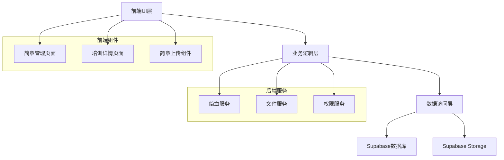
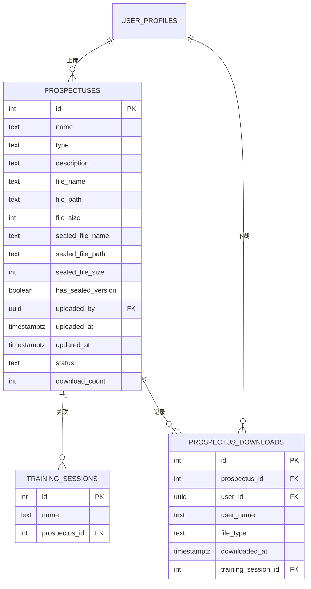

# 招商简章管理功能设计文档

## 概述

本设计文档描述了招商简章管理功能的技术实现方案。该功能将为培训管理系统增加完整的招商简章生命周期管理能力，包括文件上传、存储、关联、下载和权限控制。

## 架构

### 系统架构图



### 技术栈

- **前端**: React 18+, TypeScript, Tailwind CSS
- **状态管理**: React Context API
- **文件上传**: Supabase Storage
- **数据库**: PostgreSQL (Supabase)
- **文件格式**: PDF
- **权限控制**: Row Level Security (RLS)

## 组件和接口

### 1. 数据库设计

#### 1.1 招商简章表 (prospectuses)

```sql
CREATE TABLE IF NOT EXISTS public.prospectuses (
  id SERIAL PRIMARY KEY,
  name TEXT NOT NULL,                          -- 简章名称
  type TEXT,                                    -- 简章类型（如：技术培训、管理培训）
  description TEXT,                             -- 简章描述
  file_name TEXT NOT NULL,                      -- 原始文件名
  file_path TEXT NOT NULL,                      -- 存储路径
  file_size INTEGER,                            -- 文件大小（字节）
  sealed_file_name TEXT,                        -- 盖章文件名
  sealed_file_path TEXT,                        -- 盖章文件路径
  sealed_file_size INTEGER,                     -- 盖章文件大小
  has_sealed_version BOOLEAN DEFAULT false,     -- 是否有盖章版本
  uploaded_by UUID REFERENCES public.user_profiles(id),  -- 上传人
  uploaded_at TIMESTAMPTZ DEFAULT NOW(),        -- 上传时间
  updated_at TIMESTAMPTZ DEFAULT NOW(),         -- 更新时间
  status TEXT DEFAULT 'active',                 -- 状态：active, inactive, error
  download_count INTEGER DEFAULT 0,             -- 下载次数
  created_at TIMESTAMPTZ DEFAULT NOW()
);

-- 索引
CREATE INDEX IF NOT EXISTS idx_prospectuses_type ON public.prospectuses(type);
CREATE INDEX IF NOT EXISTS idx_prospectuses_status ON public.prospectuses(status);
CREATE INDEX IF NOT EXISTS idx_prospectuses_uploaded_by ON public.prospectuses(uploaded_by);
```

#### 1.2 更新培训场次表 (training_sessions)

```sql
-- 添加招商简章关联字段
ALTER TABLE public.training_sessions 
ADD COLUMN IF NOT EXISTS prospectus_id INTEGER REFERENCES public.prospectuses(id) ON DELETE SET NULL;

-- 添加索引
CREATE INDEX IF NOT EXISTS idx_training_sessions_prospectus ON public.training_sessions(prospectus_id);
```

#### 1.3 简章下载记录表 (prospectus_downloads)

```sql
CREATE TABLE IF NOT EXISTS public.prospectus_downloads (
  id SERIAL PRIMARY KEY,
  prospectus_id INTEGER NOT NULL REFERENCES public.prospectuses(id) ON DELETE CASCADE,
  user_id UUID NOT NULL REFERENCES public.user_profiles(id),
  user_name TEXT NOT NULL,
  file_type TEXT NOT NULL,                      -- 'original' 或 'sealed'
  downloaded_at TIMESTAMPTZ DEFAULT NOW(),
  training_session_id INTEGER REFERENCES public.training_sessions(id),  -- 可选，记录从哪个培训下载的
  created_at TIMESTAMPTZ DEFAULT NOW()
);

-- 索引
CREATE INDEX IF NOT EXISTS idx_prospectus_downloads_prospectus ON public.prospectus_downloads(prospectus_id);
CREATE INDEX IF NOT EXISTS idx_prospectus_downloads_user ON public.prospectus_downloads(user_id);
CREATE INDEX IF NOT EXISTS idx_prospectus_downloads_date ON public.prospectus_downloads(downloaded_at DESC);
```

### 2. TypeScript 类型定义

```typescript
// src/lib/supabase/types.ts

// 招商简章
export interface Prospectus {
  id: number;
  name: string;
  type: string | null;
  description: string | null;
  file_name: string;
  file_path: string;
  file_size: number | null;
  sealed_file_name: string | null;
  sealed_file_path: string | null;
  sealed_file_size: number | null;
  has_sealed_version: boolean;
  uploaded_by: string | null;
  uploaded_at: string;
  updated_at: string;
  status: 'active' | 'inactive' | 'error';
  download_count: number;
  created_at: string;
}

// 简章下载记录
export interface ProspectusDownload {
  id: number;
  prospectus_id: number;
  user_id: string;
  user_name: string;
  file_type: 'original' | 'sealed';
  downloaded_at: string;
  training_session_id: number | null;
  created_at: string;
}

// 扩展 TrainingSession 类型
export interface TrainingSession {
  // ... 现有字段
  prospectus_id: number | null;
}
```

### 3. Supabase Storage 配置

#### 3.1 Storage Bucket 创建

```typescript
// 创建 prospectuses bucket
// 在 Supabase Dashboard 中创建，或通过 SQL:
INSERT INTO storage.buckets (id, name, public)
VALUES ('prospectuses', 'prospectuses', false);
```

#### 3.2 Storage 策略

```sql
-- 允许管理员上传文件
CREATE POLICY "Admins can upload prospectuses" ON storage.objects
FOR INSERT WITH CHECK (
  bucket_id = 'prospectuses' AND
  EXISTS (
    SELECT 1 FROM public.user_profiles
    WHERE id = auth.uid() AND role = 'admin'
  )
);

-- 允许管理员删除文件
CREATE POLICY "Admins can delete prospectuses" ON storage.objects
FOR DELETE USING (
  bucket_id = 'prospectuses' AND
  EXISTS (
    SELECT 1 FROM public.user_profiles
    WHERE id = auth.uid() AND role = 'admin'
  )
);

-- 允许管理员和业务员下载文件
CREATE POLICY "Admins and salespersons can download prospectuses" ON storage.objects
FOR SELECT USING (
  bucket_id = 'prospectuses' AND
  EXISTS (
    SELECT 1 FROM public.user_profiles
    WHERE id = auth.uid() AND role IN ('admin', 'salesperson')
  )
);
```

### 4. 服务层设计

#### 4.1 ProspectusService

```typescript
// src/lib/supabase/prospectusService.ts

class ProspectusService {
  /**
   * 上传招商简章
   */
  async uploadProspectus(
    file: File,
    metadata: {
      name: string;
      type?: string;
      description?: string;
    }
  ): Promise<Prospectus>;

  /**
   * 上传盖章文件
   */
  async uploadSealedVersion(
    prospectusId: number,
    file: File
  ): Promise<Prospectus>;

  /**
   * 获取所有简章列表
   */
  async getProspectuses(): Promise<Prospectus[]>;

  /**
   * 根据ID获取简章详情
   */
  async getProspectusById(id: number): Promise<Prospectus | null>;

  /**
   * 更新简章信息
   */
  async updateProspectus(
    id: number,
    updates: Partial<Prospectus>
  ): Promise<Prospectus>;

  /**
   * 删除简章
   */
  async deleteProspectus(id: number): Promise<boolean>;

  /**
   * 删除盖章文件
   */
  async deleteSealedVersion(id: number): Promise<boolean>;

  /**
   * 下载简章文件
   */
  async downloadProspectus(
    prospectusId: number,
    preferSealed: boolean,
    trainingSessionId?: number
  ): Promise<string>;

  /**
   * 获取简章下载记录
   */
  async getDownloadHistory(
    prospectusId?: number
  ): Promise<ProspectusDownload[]>;

  /**
   * 记录下载
   */
  private async recordDownload(
    prospectusId: number,
    fileType: 'original' | 'sealed',
    trainingSessionId?: number
  ): Promise<void>;

  /**
   * 获取关联的培训场次
   */
  async getRelatedTrainingSessions(
    prospectusId: number
  ): Promise<TrainingSession[]>;
}
```

#### 4.2 文件命名规范

```typescript
// 文件命名格式
const generateFileName = (originalName: string, type: 'original' | 'sealed'): string => {
  const timestamp = Date.now();
  const randomStr = Math.random().toString(36).substring(2, 8);
  const extension = originalName.split('.').pop();
  const baseName = originalName.replace(`.${extension}`, '');
  const suffix = type === 'sealed' ? '_sealed' : '';
  
  return `${timestamp}_${randomStr}_${baseName}${suffix}.${extension}`;
};

// 存储路径格式
const getStoragePath = (fileName: string): string => {
  const date = new Date();
  const year = date.getFullYear();
  const month = String(date.getMonth() + 1).padStart(2, '0');
  
  return `${year}/${month}/${fileName}`;
};
```

### 5. 前端组件设计

**设计原则**: 所有新增的UI组件和页面必须与现有系统保持完全一致的设计风格，包括：
- 布局结构（使用现有的 Sidebar + Main Content 布局）
- 颜色方案（使用现有的 Tailwind CSS 类）
- 字体和排版
- 按钮样式和交互效果
- 模态框样式
- 表格样式
- 表单样式
- 响应式设计

#### 5.1 简章管理页面 (ProspectusManagement.tsx)

**页面位置**: 
- 在左侧导航栏添加"招商简章"菜单项
- 路由路径: `/prospectus-management`
- 仅管理员可见

**UI设计原则**:
- 完全遵循现有系统的UI风格和布局
- 使用与其他管理页面相同的组件样式（如 CustomerManagement、ExpertManagement）
- 保持一致的颜色方案、字体、间距和交互模式
- 使用现有的 Sidebar 组件和页面布局结构

**功能**:
- 显示所有招商简章列表
- 搜索和筛选简章
- 上传新简章
- 编辑简章信息
- 上传盖章文件
- 删除简章
- 查看下载记录

**组件结构**:
```
ProspectusManagement
├── Sidebar (复用现有侧边栏组件)
├── Header (顶部导航栏，与其他页面一致)
├── SearchBar (搜索栏，样式与现有页面一致)
├── ProspectusTable (简章列表表格，样式参考 CustomerManagement)
│   ├── ProspectusRow (简章行)
│   └── ActionButtons (操作按钮)
├── UploadModal (上传模态框，样式与现有模态框一致)
├── EditModal (编辑模态框)
└── DownloadHistoryModal (下载记录模态框)
```

**页面布局参考**:
```tsx
// 参考 CustomerManagement.tsx 的布局结构
<div className="flex h-screen bg-gray-50 dark:bg-gray-900 overflow-hidden">
  <Sidebar sidebarOpen={sidebarOpen} setSidebarOpen={setSidebarOpen} currentPath={location.pathname} />
  
  <div className="flex-1 flex flex-col overflow-hidden">
    <header className="bg-white dark:bg-gray-800 shadow-sm z-20">
      {/* 顶部导航栏 */}
    </header>
    
    <main className="flex-1 overflow-y-auto p-4 sm:p-6 bg-gray-50 dark:bg-gray-900">
      {/* 搜索和筛选区域 */}
      {/* 数据表格 */}
    </main>
  </div>
</div>
```

#### 5.2 简章上传组件 (ProspectusUpload.tsx)

**功能**:
- 文件选择和验证
- 拖拽上传支持
- 上传进度显示
- 元数据输入表单

**验证规则**:
- 文件格式: 仅PDF
- 文件大小: 最大10MB
- 必填字段: 简章名称

#### 5.3 培训详情页简章区域

**在现有的培训详情模态框中添加**:

```tsx
{/* 招商简章区域 */}
{selectedSession?.prospectus_id && (
  <div className="mt-6 p-4 bg-blue-50 dark:bg-blue-900/20 rounded-lg">
    <h3 className="text-lg font-semibold mb-3 flex items-center">
      <FileText className="mr-2" size={20} />
      招商简章
    </h3>
    <div className="flex items-center justify-between">
      <div>
        <p className="text-sm text-gray-600 dark:text-gray-400">
          {prospectusName}
        </p>
        {hasSealed && (
          <span className="text-xs text-green-600 dark:text-green-400">
            ✓ 已盖章
          </span>
        )}
      </div>
      <button
        onClick={() => handleDownloadProspectus(selectedSession.prospectus_id)}
        className="px-4 py-2 bg-blue-600 hover:bg-blue-700 text-white rounded-lg flex items-center"
      >
        <Download size={16} className="mr-2" />
        下载简章
      </button>
    </div>
  </div>
)}
```

#### 5.4 培训编辑表单简章选择

**在培训添加/编辑模态框中添加**:

```tsx
{/* 招商简章选择 */}
<div>
  <label className="block text-sm font-medium text-gray-700 dark:text-gray-300 mb-1">
    招商简章
  </label>
  <select
    name="prospectusId"
    defaultValue={editSession?.prospectus_id || ''}
    className="w-full px-4 py-2 rounded-lg border border-gray-300 dark:border-gray-600 bg-white dark:bg-gray-700 text-gray-800 dark:text-white focus:ring-2 focus:ring-blue-500 focus:border-transparent transition-all"
  >
    <option value="">不关联简章</option>
    {prospectuses.map(p => (
      <option key={p.id} value={p.id}>
        {p.name} {p.has_sealed_version && '(已盖章)'}
      </option>
    ))}
  </select>
</div>
```

## 数据模型

### ER 图



## 错误处理

### 错误类型

1. **文件验证错误**
   - 文件格式不正确
   - 文件大小超限
   - 文件损坏

2. **权限错误**
   - 用户无权限上传
   - 用户无权限下载
   - 用户无权限删除

3. **存储错误**
   - 上传失败
   - 下载失败
   - 删除失败

4. **数据库错误**
   - 记录创建失败
   - 记录更新失败
   - 外键约束冲突

### 错误处理策略

```typescript
// 统一错误处理
class ProspectusError extends Error {
  constructor(
    public code: string,
    public message: string,
    public details?: any
  ) {
    super(message);
  }
}

// 错误码定义
enum ProspectusErrorCode {
  INVALID_FILE_FORMAT = 'INVALID_FILE_FORMAT',
  FILE_TOO_LARGE = 'FILE_TOO_LARGE',
  UPLOAD_FAILED = 'UPLOAD_FAILED',
  DOWNLOAD_FAILED = 'DOWNLOAD_FAILED',
  PERMISSION_DENIED = 'PERMISSION_DENIED',
  NOT_FOUND = 'NOT_FOUND',
  HAS_RELATED_SESSIONS = 'HAS_RELATED_SESSIONS'
}

// 错误处理示例
try {
  await prospectusService.uploadProspectus(file, metadata);
} catch (error) {
  if (error instanceof ProspectusError) {
    switch (error.code) {
      case ProspectusErrorCode.INVALID_FILE_FORMAT:
        toast.error('文件格式不正确，请上传PDF文件');
        break;
      case ProspectusErrorCode.FILE_TOO_LARGE:
        toast.error('文件大小超过10MB限制');
        break;
      case ProspectusErrorCode.PERMISSION_DENIED:
        toast.error('您没有权限执行此操作');
        break;
      default:
        toast.error('操作失败，请重试');
    }
  }
}
```

## 测试策略

### 单元测试

1. **ProspectusService 测试**
   - 文件上传功能
   - 文件下载功能
   - 元数据管理
   - 权限验证

2. **组件测试**
   - ProspectusUpload 组件
   - ProspectusManagement 页面
   - 培训详情页简章区域

### 集成测试

1. **完整流程测试**
   - 上传简章 → 关联培训 → 下载简章
   - 上传盖章文件 → 优先下载盖章版本
   - 删除简章 → 检查关联培训

2. **权限测试**
   - 管理员权限测试
   - 业务员权限测试
   - 专家权限测试

### 性能测试

1. **文件上传性能**
   - 大文件上传测试（接近10MB）
   - 并发上传测试

2. **文件下载性能**
   - 多用户同时下载
   - 下载速度测试

## 安全考虑

### 1. 文件安全

- **文件类型验证**: 前端和后端双重验证，仅允许PDF格式
- **文件大小限制**: 最大10MB，防止存储滥用
- **文件扫描**: 建议集成病毒扫描（可选）
- **文件名处理**: 使用时间戳和随机字符串，避免文件名冲突和路径遍历攻击

### 2. 访问控制

- **RLS策略**: 使用Supabase Row Level Security确保数据安全
- **角色权限**: 
  - 管理员: 完全控制
  - 业务员: 仅下载
  - 专家: 仅查看（不下载）
- **URL签名**: 使用Supabase的签名URL，防止直接访问

### 3. 数据完整性

- **外键约束**: 确保数据关联的完整性
- **级联删除**: 删除简章时同时删除下载记录
- **事务处理**: 文件上传和数据库记录创建使用事务

### 4. 审计日志

- **下载记录**: 记录所有下载操作
- **操作日志**: 记录上传、编辑、删除操作
- **用户追踪**: 记录操作用户和时间

## 性能优化

### 1. 文件存储优化

- **CDN加速**: 使用Supabase CDN加速文件下载
- **分片上传**: 大文件使用分片上传（如需要）
- **压缩**: PDF文件压缩（可选）

### 2. 数据库优化

- **索引**: 为常用查询字段添加索引
- **分页**: 简章列表和下载记录使用分页
- **缓存**: 简章列表使用前端缓存

### 3. 前端优化

- **懒加载**: 简章列表使用虚拟滚动
- **预加载**: 预加载常用简章信息
- **防抖**: 搜索输入使用防抖

## 部署考虑

### 1. 数据库迁移

```sql
-- 迁移脚本
-- 1. 创建 prospectuses 表
-- 2. 创建 prospectus_downloads 表
-- 3. 更新 training_sessions 表
-- 4. 创建索引
-- 5. 设置 RLS 策略
```

### 2. Storage 配置

- 创建 prospectuses bucket
- 配置 Storage 策略
- 设置 CORS 规则

### 3. 环境变量

```env
# Supabase
VITE_SUPABASE_URL=your_supabase_url
VITE_SUPABASE_ANON_KEY=your_anon_key

# 文件上传限制
VITE_MAX_FILE_SIZE=10485760  # 10MB in bytes
```

## 监控和维护

### 1. 监控指标

- 文件上传成功率
- 文件下载成功率
- 平均上传/下载时间
- 存储空间使用情况
- 下载次数统计

### 2. 定期维护

- 清理过期或无效的简章文件
- 检查文件完整性
- 备份重要简章文件
- 审查下载记录

### 3. 日志记录

- 上传/下载操作日志
- 错误日志
- 性能日志
- 安全事件日志
