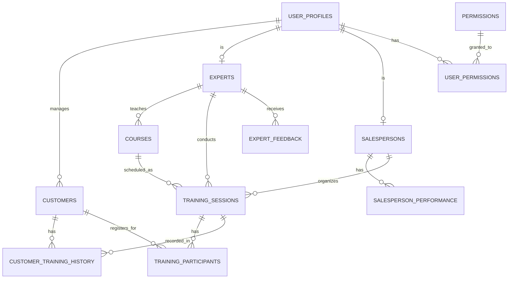
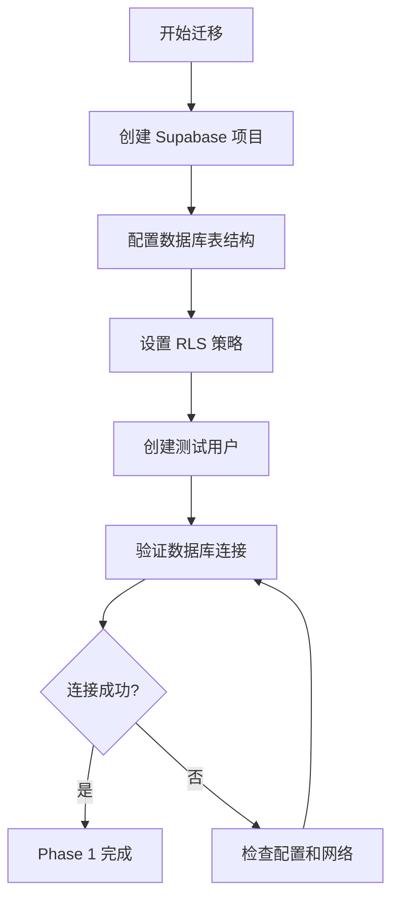
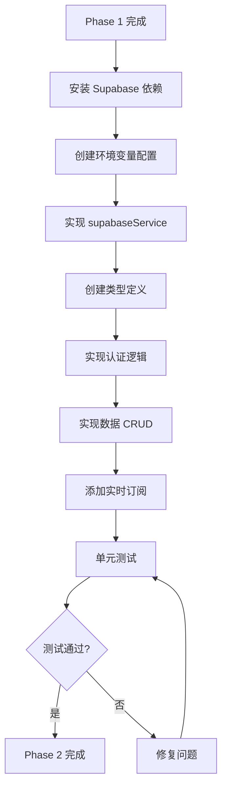
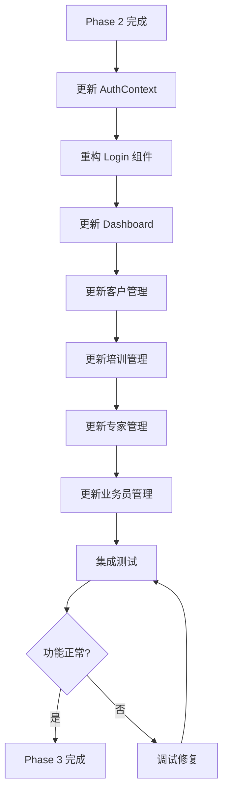
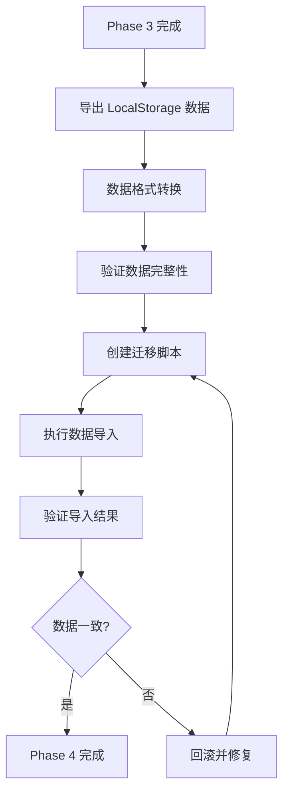
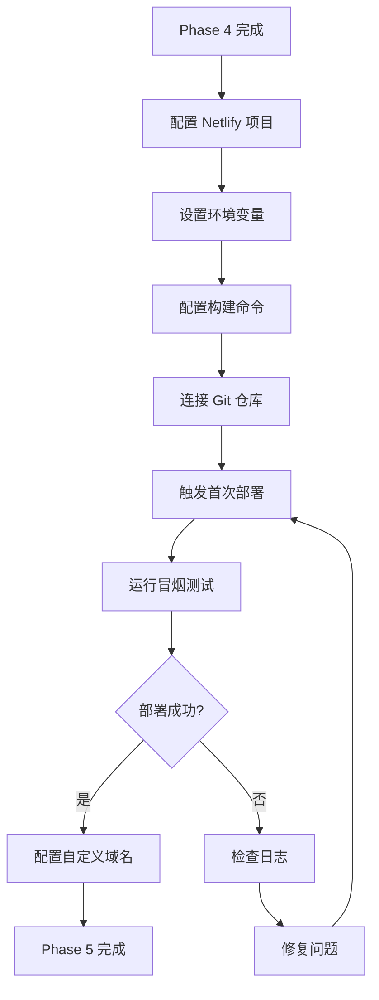

# Design Document

## Overview

本设计文档详细描述了将培训管理系统从 LocalStorage 架构迁移到 Supabase + Netlify 架构的技术方案。迁移采用渐进式策略，确保每个阶段都可以独立测试和验证，最大程度降低风险。

## Architecture

### 当前架构 (Before Migration)

```
┌─────────────────────────────────────────────┐
│           React Application                  │
│  ┌─────────────────────────────────────┐   │
│  │      UI Components (Pages)           │   │
│  └──────────────┬───────────────────────┘   │
│                 │                             │
│  ┌──────────────▼───────────────────────┐   │
│  │      dataService.ts                   │   │
│  │  (LocalStorage CRUD Operations)       │   │
│  └──────────────┬───────────────────────┘   │
│                 │                             │
│  ┌──────────────▼───────────────────────┐   │
│  │      Browser LocalStorage             │   │
│  │  (JSON Data Storage)                  │   │
│  └───────────────────────────────────────┘   │
└─────────────────────────────────────────────┘
```

### 目标架构 (After Migration)

```
┌─────────────────────────────────────────────────────────────┐
│                    Netlify (Frontend Host)                   │
│  ┌───────────────────────────────────────────────────────┐  │
│  │              React Application                         │  │
│  │  ┌─────────────────────────────────────────────────┐  │  │
│  │  │         UI Components (Pages)                    │  │  │
│  │  └──────────────┬───────────────────────────────────┘  │  │
│  │                 │                                       │  │
│  │  ┌──────────────▼───────────────────────────────────┐  │  │
│  │  │      supabaseService.ts                          │  │  │
│  │  │  (Supabase Client Wrapper)                       │  │  │
│  │  └──────────────┬───────────────────────────────────┘  │  │
│  └─────────────────┼───────────────────────────────────────┘  │
└───────────────────┼───────────────────────────────────────────┘
                    │
                    │ HTTPS/WebSocket
                    │
┌───────────────────▼───────────────────────────────────────────┐
│                    Supabase (Backend)                          │
│  ┌─────────────────────────────────────────────────────────┐  │
│  │              Supabase Auth                               │  │
│  │  (JWT Token Management, User Authentication)             │  │
│  └─────────────────────────────────────────────────────────┘  │
│  ┌─────────────────────────────────────────────────────────┐  │
│  │              PostgreSQL Database                         │  │
│  │  ┌─────────┬─────────┬─────────┬──────────┬──────────┐  │  │
│  │  │ users   │customers│ experts │salespersons│training│  │  │
│  │  │         │         │         │           │sessions │  │  │
│  │  └─────────┴─────────┴─────────┴──────────┴──────────┘  │  │
│  │              Row Level Security (RLS)                    │  │
│  └─────────────────────────────────────────────────────────┘  │
│  ┌─────────────────────────────────────────────────────────┐  │
│  │              Real-time Engine                            │  │
│  │  (WebSocket Subscriptions for Live Updates)              │  │
│  └─────────────────────────────────────────────────────────┘  │
│  ┌─────────────────────────────────────────────────────────┐  │
│  │              Storage (Optional)                          │  │
│  │  (File uploads: avatars, documents)                      │  │
│  └─────────────────────────────────────────────────────────┘  │
└─────────────────────────────────────────────────────────────┘
```

## Components and Interfaces

### 1. Database Schema

#### Tables Structure

```sql
-- Users table (managed by Supabase Auth)
CREATE TABLE auth.users (
  id UUID PRIMARY KEY DEFAULT uuid_generate_v4(),
  email TEXT UNIQUE NOT NULL,
  encrypted_password TEXT NOT NULL,
  created_at TIMESTAMPTZ DEFAULT NOW()
);

-- User profiles table (extends auth.users)
CREATE TABLE public.user_profiles (
  id UUID PRIMARY KEY REFERENCES auth.users(id) ON DELETE CASCADE,
  username TEXT UNIQUE NOT NULL,
  role TEXT NOT NULL CHECK (role IN ('admin', 'salesperson', 'expert')),
  name TEXT NOT NULL,
  department TEXT,
  created_at TIMESTAMPTZ DEFAULT NOW(),
  updated_at TIMESTAMPTZ DEFAULT NOW()
);

-- Customers table
CREATE TABLE public.customers (
  id SERIAL PRIMARY KEY,
  name TEXT NOT NULL,
  avatar TEXT,
  phone TEXT,
  email TEXT,
  company TEXT,
  position TEXT,
  location TEXT,
  status TEXT,
  salesperson_id UUID REFERENCES public.user_profiles(id),
  salesperson_name TEXT,
  follow_up_status TEXT,
  created_at TIMESTAMPTZ DEFAULT NOW(),
  last_contact TIMESTAMPTZ,
  tags TEXT[]
);

-- Experts table
CREATE TABLE public.experts (
  id SERIAL PRIMARY KEY,
  user_id UUID REFERENCES public.user_profiles(id),
  name TEXT NOT NULL,
  avatar TEXT,
  title TEXT,
  field TEXT,
  experience TEXT,
  rating DECIMAL(3,2),
  courses TEXT[],
  location TEXT,
  available BOOLEAN DEFAULT true,
  bio TEXT,
  past_sessions INTEGER DEFAULT 0,
  total_participants INTEGER DEFAULT 0,
  created_at TIMESTAMPTZ DEFAULT NOW()
);

-- Salespersons table
CREATE TABLE public.salespersons (
  id SERIAL PRIMARY KEY,
  user_id UUID REFERENCES public.user_profiles(id),
  name TEXT NOT NULL,
  avatar TEXT,
  department TEXT,
  position TEXT,
  phone TEXT,
  email TEXT,
  join_date DATE,
  status TEXT,
  team TEXT,
  created_at TIMESTAMPTZ DEFAULT NOW()
);

-- Salesperson performance table
CREATE TABLE public.salesperson_performance (
  id SERIAL PRIMARY KEY,
  salesperson_id INTEGER REFERENCES public.salespersons(id),
  revenue DECIMAL(10,2) DEFAULT 0,
  completed_sessions INTEGER DEFAULT 0,
  conversion_rate DECIMAL(5,2) DEFAULT 0,
  customers_count INTEGER DEFAULT 0,
  updated_at TIMESTAMPTZ DEFAULT NOW()
);

-- Courses table
CREATE TABLE public.courses (
  id TEXT PRIMARY KEY,
  name TEXT NOT NULL,
  description TEXT,
  duration INTEGER,
  price DECIMAL(10,2),
  category TEXT,
  expert_id INTEGER REFERENCES public.experts(id),
  created_at TIMESTAMPTZ DEFAULT NOW(),
  updated_at TIMESTAMPTZ DEFAULT NOW()
);

-- Training sessions table
CREATE TABLE public.training_sessions (
  id SERIAL PRIMARY KEY,
  name TEXT NOT NULL,
  date DATE NOT NULL,
  start_time TIME,
  end_time TIME,
  participants INTEGER DEFAULT 0,
  expert_id INTEGER REFERENCES public.experts(id),
  expert_name TEXT,
  area TEXT,
  revenue DECIMAL(10,2),
  status TEXT,
  rating DECIMAL(3,2),
  salesperson_id INTEGER REFERENCES public.salespersons(id),
  salesperson_name TEXT,
  course_id TEXT REFERENCES public.courses(id),
  created_at TIMESTAMPTZ DEFAULT NOW()
);

-- Training participants table
CREATE TABLE public.training_participants (
  id SERIAL PRIMARY KEY,
  training_session_id INTEGER REFERENCES public.training_sessions(id) ON DELETE CASCADE,
  customer_id INTEGER REFERENCES public.customers(id),
  name TEXT NOT NULL,
  phone TEXT,
  email TEXT,
  registration_date DATE,
  payment_status TEXT,
  salesperson_name TEXT,
  created_at TIMESTAMPTZ DEFAULT NOW()
);

-- Customer training history table
CREATE TABLE public.customer_training_history (
  id SERIAL PRIMARY KEY,
  customer_id INTEGER REFERENCES public.customers(id) ON DELETE CASCADE,
  training_session_id INTEGER REFERENCES public.training_sessions(id),
  training_name TEXT,
  date DATE,
  status TEXT,
  created_at TIMESTAMPTZ DEFAULT NOW()
);

-- Permissions table
CREATE TABLE public.permissions (
  id TEXT PRIMARY KEY,
  name TEXT NOT NULL,
  description TEXT,
  category TEXT
);

-- User permissions junction table
CREATE TABLE public.user_permissions (
  user_id UUID REFERENCES public.user_profiles(id) ON DELETE CASCADE,
  permission_id TEXT REFERENCES public.permissions(id) ON DELETE CASCADE,
  PRIMARY KEY (user_id, permission_id)
);

-- Expert feedback table
CREATE TABLE public.expert_feedback (
  id SERIAL PRIMARY KEY,
  expert_id INTEGER REFERENCES public.experts(id) ON DELETE CASCADE,
  content TEXT,
  rating INTEGER CHECK (rating >= 1 AND rating <= 5),
  created_at TIMESTAMPTZ DEFAULT NOW()
);
```

#### Indexes for Performance

```sql
-- Customer indexes
CREATE INDEX idx_customers_salesperson ON public.customers(salesperson_id);
CREATE INDEX idx_customers_status ON public.customers(status);
CREATE INDEX idx_customers_created_at ON public.customers(created_at DESC);

-- Training session indexes
CREATE INDEX idx_training_sessions_date ON public.training_sessions(date DESC);
CREATE INDEX idx_training_sessions_expert ON public.training_sessions(expert_id);
CREATE INDEX idx_training_sessions_salesperson ON public.training_sessions(salesperson_id);
CREATE INDEX idx_training_sessions_status ON public.training_sessions(status);

-- User profile indexes
CREATE INDEX idx_user_profiles_role ON public.user_profiles(role);
CREATE INDEX idx_user_profiles_username ON public.user_profiles(username);
```

### 2. Row Level Security (RLS) Policies

```sql
-- Enable RLS on all tables
ALTER TABLE public.user_profiles ENABLE ROW LEVEL SECURITY;
ALTER TABLE public.customers ENABLE ROW LEVEL SECURITY;
ALTER TABLE public.experts ENABLE ROW LEVEL SECURITY;
ALTER TABLE public.salespersons ENABLE ROW LEVEL SECURITY;
ALTER TABLE public.training_sessions ENABLE ROW LEVEL SECURITY;
ALTER TABLE public.courses ENABLE ROW LEVEL SECURITY;

-- User profiles policies
CREATE POLICY "Users can view their own profile"
  ON public.user_profiles FOR SELECT
  USING (auth.uid() = id);

CREATE POLICY "Admins can view all profiles"
  ON public.user_profiles FOR SELECT
  USING (
    EXISTS (
      SELECT 1 FROM public.user_profiles
      WHERE id = auth.uid() AND role = 'admin'
    )
  );

-- Customers policies
CREATE POLICY "Admins can view all customers"
  ON public.customers FOR ALL
  USING (
    EXISTS (
      SELECT 1 FROM public.user_profiles
      WHERE id = auth.uid() AND role = 'admin'
    )
  );

CREATE POLICY "Salespersons can view their own customers"
  ON public.customers FOR SELECT
  USING (
    salesperson_id = auth.uid()
  );

CREATE POLICY "Salespersons can insert their own customers"
  ON public.customers FOR INSERT
  WITH CHECK (
    salesperson_id = auth.uid()
  );

CREATE POLICY "Salespersons can update their own customers"
  ON public.customers FOR UPDATE
  USING (salesperson_id = auth.uid())
  WITH CHECK (salesperson_id = auth.uid());

-- Training sessions policies
CREATE POLICY "Admins can manage all training sessions"
  ON public.training_sessions FOR ALL
  USING (
    EXISTS (
      SELECT 1 FROM public.user_profiles
      WHERE id = auth.uid() AND role = 'admin'
    )
  );

CREATE POLICY "Salespersons can view training sessions"
  ON public.training_sessions FOR SELECT
  USING (
    EXISTS (
      SELECT 1 FROM public.user_profiles
      WHERE id = auth.uid() AND role = 'salesperson'
    )
  );

CREATE POLICY "Experts can view their own training sessions"
  ON public.training_sessions FOR SELECT
  USING (
    EXISTS (
      SELECT 1 FROM public.experts
      WHERE user_id = auth.uid() AND id = expert_id
    )
  );

-- Courses policies (public read, admin write)
CREATE POLICY "Anyone can view courses"
  ON public.courses FOR SELECT
  USING (true);

CREATE POLICY "Admins can manage courses"
  ON public.courses FOR ALL
  USING (
    EXISTS (
      SELECT 1 FROM public.user_profiles
      WHERE id = auth.uid() AND role = 'admin'
    )
  );
```

### 3. Supabase Service Layer

#### Interface Definition

```typescript
// src/lib/supabase/types.ts
export interface Database {
  public: {
    Tables: {
      user_profiles: {
        Row: UserProfile;
        Insert: Omit<UserProfile, 'id' | 'created_at' | 'updated_at'>;
        Update: Partial<Omit<UserProfile, 'id'>>;
      };
      customers: {
        Row: Customer;
        Insert: Omit<Customer, 'id' | 'created_at'>;
        Update: Partial<Omit<Customer, 'id'>>;
      };
      // ... other tables
    };
  };
}

// src/lib/supabase/client.ts
import { createClient } from '@supabase/supabase-js';
import type { Database } from './types';

const supabaseUrl = import.meta.env.VITE_SUPABASE_URL;
const supabaseAnonKey = import.meta.env.VITE_SUPABASE_ANON_KEY;

export const supabase = createClient<Database>(supabaseUrl, supabaseAnonKey, {
  auth: {
    persistSession: true,
    autoRefreshToken: true,
  },
  realtime: {
    params: {
      eventsPerSecond: 10,
    },
  },
});
```

#### Service Implementation

```typescript
// src/lib/supabase/supabaseService.ts
class SupabaseService {
  // Authentication
  async signIn(email: string, password: string) {
    const { data, error } = await supabase.auth.signInWithPassword({
      email,
      password,
    });
    if (error) throw error;
    
    // Fetch user profile
    const { data: profile } = await supabase
      .from('user_profiles')
      .select('*')
      .eq('id', data.user.id)
      .single();
    
    return { user: data.user, profile };
  }

  async signOut() {
    const { error } = await supabase.auth.signOut();
    if (error) throw error;
  }

  // Customers
  async getCustomers() {
    const { data, error } = await supabase
      .from('customers')
      .select('*')
      .order('created_at', { ascending: false });
    
    if (error) throw error;
    return data;
  }

  async addCustomer(customer: Omit<Customer, 'id'>) {
    const { data, error } = await supabase
      .from('customers')
      .insert(customer)
      .select()
      .single();
    
    if (error) throw error;
    return data;
  }

  // Real-time subscriptions
  subscribeToCustomers(callback: (payload: any) => void) {
    return supabase
      .channel('customers-changes')
      .on(
        'postgres_changes',
        { event: '*', schema: 'public', table: 'customers' },
        callback
      )
      .subscribe();
  }

  // ... other methods
}

export default new SupabaseService();
```

## Data Models

### Entity Relationship Diagram



## Migration Flow

### Phase 1: Preparation and Setup



### Phase 2: Code Migration



### Phase 3: Component Integration



### Phase 4: Data Migration



### Phase 5: Deployment



## Error Handling

### Error Handling Strategy

```typescript
// src/lib/supabase/errorHandler.ts
export class SupabaseError extends Error {
  constructor(
    message: string,
    public code: string,
    public details?: any
  ) {
    super(message);
    this.name = 'SupabaseError';
  }
}

export function handleSupabaseError(error: any): SupabaseError {
  // Authentication errors
  if (error.message?.includes('Invalid login credentials')) {
    return new SupabaseError(
      '用户名或密码错误',
      'AUTH_INVALID_CREDENTIALS'
    );
  }
  
  // Permission errors
  if (error.code === 'PGRST301') {
    return new SupabaseError(
      '您没有权限执行此操作',
      'PERMISSION_DENIED'
    );
  }
  
  // Network errors
  if (error.message?.includes('Failed to fetch')) {
    return new SupabaseError(
      '网络连接失败，请检查您的网络',
      'NETWORK_ERROR'
    );
  }
  
  // Generic error
  return new SupabaseError(
    error.message || '操作失败，请稍后重试',
    'UNKNOWN_ERROR',
    error
  );
}
```

### Rollback Strategy

```sql
-- Rollback script template
BEGIN;

-- Step 1: Backup current data
CREATE TABLE backup_customers AS SELECT * FROM customers;
CREATE TABLE backup_training_sessions AS SELECT * FROM training_sessions;
-- ... other tables

-- Step 2: If migration fails, restore from backup
-- INSERT INTO customers SELECT * FROM backup_customers;
-- INSERT INTO training_sessions SELECT * FROM backup_training_sessions;

-- Step 3: Clean up backup tables
-- DROP TABLE backup_customers;
-- DROP TABLE backup_training_sessions;

COMMIT;
```

## Testing Strategy

### Test Levels

1. **Unit Tests**
   - Test individual service methods
   - Mock Supabase client
   - Verify error handling

2. **Integration Tests**
   - Test database operations
   - Verify RLS policies
   - Test real-time subscriptions

3. **E2E Tests**
   - Test complete user flows
   - Verify authentication
   - Test multi-user scenarios

4. **Performance Tests**
   - Load testing with 100+ concurrent users
   - Query performance benchmarks
   - Real-time sync latency

### Test Checklist

```markdown
## Authentication Tests
- [ ] User can login with valid credentials
- [ ] User cannot login with invalid credentials
- [ ] Session persists after page refresh
- [ ] User can logout successfully
- [ ] Token auto-refresh works

## Permission Tests
- [ ] Admin can view all customers
- [ ] Salesperson can only view own customers
- [ ] Expert can only view own training sessions
- [ ] Unauthorized access is blocked
- [ ] RLS policies are enforced

## CRUD Tests
- [ ] Create customer works
- [ ] Read customers works with filters
- [ ] Update customer works
- [ ] Delete customer works
- [ ] Cascade deletes work correctly

## Real-time Tests
- [ ] Changes propagate to other clients
- [ ] Reconnection works after disconnect
- [ ] No duplicate updates received
- [ ] Subscription cleanup on unmount

## Data Migration Tests
- [ ] All records migrated successfully
- [ ] Data integrity maintained
- [ ] Relationships preserved
- [ ] No data loss occurred
```

## Performance Optimization

### Caching Strategy

```typescript
// src/lib/cache/cacheManager.ts
class CacheManager {
  private cache = new Map<string, { data: any; timestamp: number }>();
  private TTL = 5 * 60 * 1000; // 5 minutes

  get(key: string) {
    const cached = this.cache.get(key);
    if (!cached) return null;
    
    if (Date.now() - cached.timestamp > this.TTL) {
      this.cache.delete(key);
      return null;
    }
    
    return cached.data;
  }

  set(key: string, data: any) {
    this.cache.set(key, { data, timestamp: Date.now() });
  }

  invalidate(key: string) {
    this.cache.delete(key);
  }

  clear() {
    this.cache.clear();
  }
}

export default new CacheManager();
```

### Query Optimization

```typescript
// Batch loading with pagination
async function getCustomersOptimized(page = 1, pageSize = 50) {
  const from = (page - 1) * pageSize;
  const to = from + pageSize - 1;
  
  const { data, error, count } = await supabase
    .from('customers')
    .select('*', { count: 'exact' })
    .range(from, to)
    .order('created_at', { ascending: false });
  
  return { data, totalPages: Math.ceil(count / pageSize) };
}

// Selective field loading
async function getCustomersList() {
  const { data, error } = await supabase
    .from('customers')
    .select('id, name, company, status, salesperson_name')
    .order('created_at', { ascending: false });
  
  return data;
}
```

## Security Considerations

### Environment Variables

```env
# .env.example
VITE_SUPABASE_URL=https://your-project.supabase.co
VITE_SUPABASE_ANON_KEY=your-anon-key

# Never commit these to version control!
# Add .env to .gitignore
```

### API Key Protection

```typescript
// Validate environment variables on startup
function validateEnv() {
  const required = ['VITE_SUPABASE_URL', 'VITE_SUPABASE_ANON_KEY'];
  
  for (const key of required) {
    if (!import.meta.env[key]) {
      throw new Error(`Missing required environment variable: ${key}`);
    }
  }
}

validateEnv();
```

### SQL Injection Prevention

Supabase automatically prevents SQL injection through parameterized queries. Always use the client methods instead of raw SQL:

```typescript
// ✅ Safe - parameterized
const { data } = await supabase
  .from('customers')
  .select('*')
  .eq('name', userInput);

// ❌ Unsafe - never do this
const { data } = await supabase
  .rpc('raw_query', { query: `SELECT * FROM customers WHERE name = '${userInput}'` });
```

## Deployment Configuration

### Netlify Configuration

```toml
# netlify.toml
[build]
  command = "pnpm build"
  publish = "dist/static"

[build.environment]
  NODE_VERSION = "18"

[[redirects]]
  from = "/*"
  to = "/index.html"
  status = 200

[[headers]]
  for = "/*"
  [headers.values]
    X-Frame-Options = "DENY"
    X-Content-Type-Options = "nosniff"
    Referrer-Policy = "strict-origin-when-cross-origin"
```

### Environment Variables in Netlify

1. Go to Site Settings → Environment Variables
2. Add:
   - `VITE_SUPABASE_URL`
   - `VITE_SUPABASE_ANON_KEY`
3. Deploy triggers automatically

## Monitoring and Logging

### Logging Strategy

```typescript
// src/lib/logger.ts
enum LogLevel {
  DEBUG = 'debug',
  INFO = 'info',
  WARN = 'warn',
  ERROR = 'error',
}

class Logger {
  log(level: LogLevel, message: string, data?: any) {
    const timestamp = new Date().toISOString();
    const logEntry = {
      timestamp,
      level,
      message,
      data,
    };
    
    // In production, send to logging service
    if (import.meta.env.PROD) {
      // Send to external logging service
      this.sendToLoggingService(logEntry);
    } else {
      console[level](message, data);
    }
  }

  error(message: string, error: any) {
    this.log(LogLevel.ERROR, message, {
      error: error.message,
      stack: error.stack,
    });
  }
}

export default new Logger();
```

## Conclusion

This design provides a comprehensive migration path from LocalStorage to Supabase with:
- Zero downtime deployment
- Data integrity guarantees
- Comprehensive error handling
- Performance optimization
- Security best practices
- Rollback capabilities

The phased approach ensures each component can be tested independently before moving to the next phase.
