# Supabase 迁移完整流程图

## 总体迁移流程

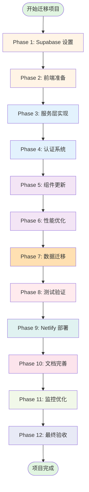

## Phase 1: Supabase 项目设置详细流程

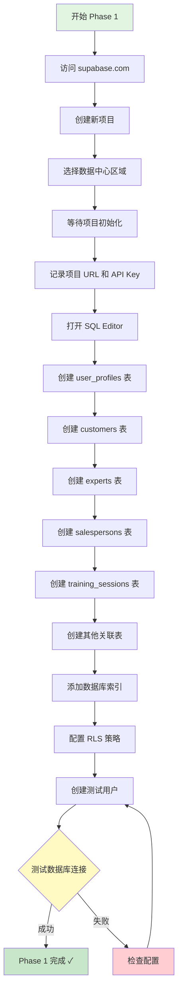

## Phase 2-3: 代码准备和服务层实现

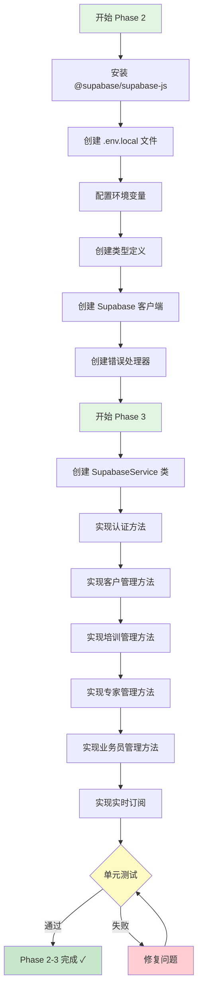

## Phase 4-5: 认证和组件更新

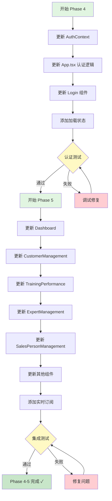

## Phase 6: 性能优化流程

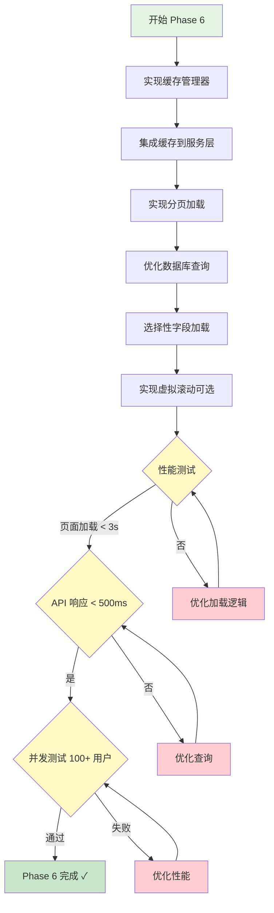

## Phase 7: 数据迁移详细流程

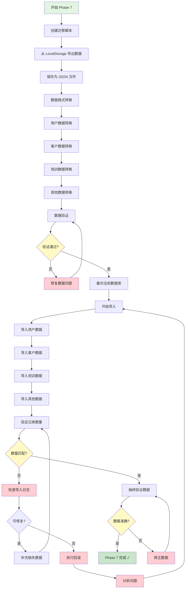

## Phase 8: 测试验证流程

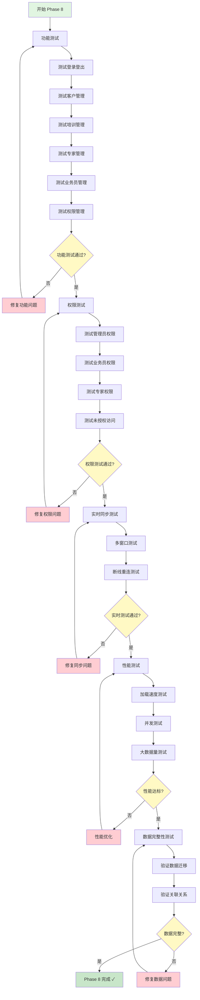

## Phase 9: Netlify 部署流程

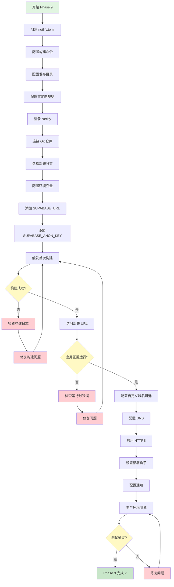

## Phase 10-12: 文档、监控和验收

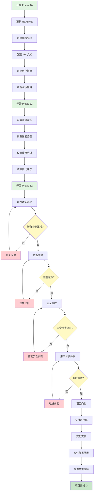

## 关键决策点和风险控制

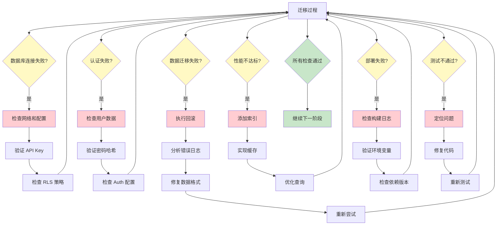

## 时间估算

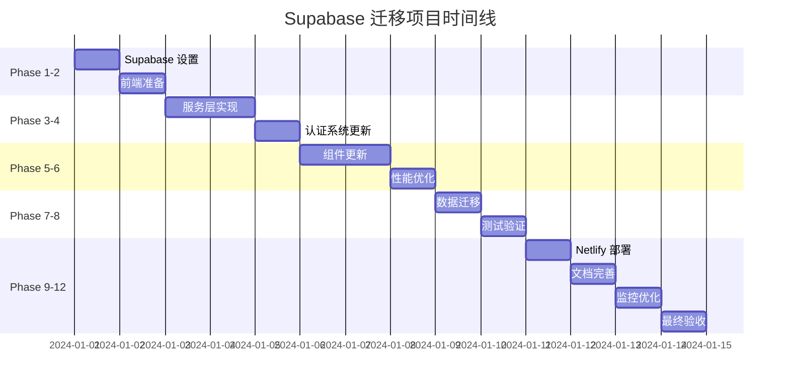

**总计：约 12 天（工作日）**

## 每日检查清单

### 每日开始前
- [ ] 备份当前代码
- [ ] 备份数据库（如已有数据）
- [ ] 检查开发环境
- [ ] 查看今日任务

### 每日结束时
- [ ] 提交代码到 Git
- [ ] 更新任务状态
- [ ] 记录遇到的问题
- [ ] 记录解决方案
- [ ] 规划明日任务

### 每个 Phase 完成后
- [ ] 运行所有测试
- [ ] 验证功能正常
- [ ] 更新文档
- [ ] 代码审查
- [ ] 标记 Phase 完成

## 紧急回滚流程

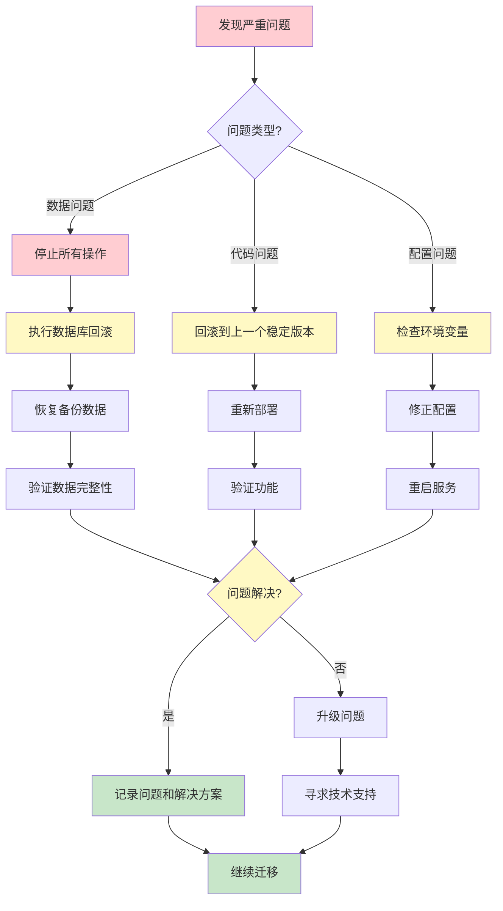
