# Supabase 迁移完整流程图

## 总体迁移流程

```mermaid
graph TB
    Start([开始迁移项目]) --> Phase1[Phase 1: Supabase 设置]
    Phase1 --> Phase2[Phase 2: 前端准备]
    Phase2 --> Phase3[Phase 3: 服务层实现]
    Phase3 --> Phase4[Phase 4: 认证系统]
    Phase4 --> Phase5[Phase 5: 组件更新]
    Phase5 --> Phase6[Phase 6: 性能优化]
    Phase6 --> Phase7[Phase 7: 数据迁移]
    Phase7 --> Phase8[Phase 8: 测试验证]
    Phase8 --> Phase9[Phase 9: Netlify 部署]
    Phase9 --> Phase10[Phase 10: 文档完善]
    Phase10 --> Phase11[Phase 11: 监控优化]
    Phase11 --> Phase12[Phase 12: 最终验收]
    Phase12 --> End([项目完成])
    
    style Start fill:#e1f5e1
    style End fill:#e1f5e1
    style Phase1 fill:#fff4e6
    style Phase2 fill:#fff4e6
    style Phase3 fill:#e3f2fd
    style Phase4 fill:#e3f2fd
    style Phase5 fill:#f3e5f5
    style Phase6 fill:#f3e5f5
    style Phase7 fill:#ffe0b2
    style Phase8 fill:#ffebee
    style Phase9 fill:#e0f2f1
    style Phase10 fill:#fce4ec
    style Phase11 fill:#f1f8e9
    style Phase12 fill:#e8eaf6
```

## Phase 1: Supabase 项目设置详细流程

```mermaid
flowchart TD
    A[开始 Phase 1] --> B[访问 supabase.com]
    B --> C[创建新项目]
    C --> D[选择数据中心区域]
    D --> E[等待项目初始化]
    E --> F[记录项目 URL 和 API Key]
    
    F --> G[打开 SQL Editor]
    G --> H[创建 user_profiles 表]
    H --> I[创建 customers 表]
    I --> J[创建 experts 表]
    J --> K[创建 salespersons 表]
    K --> L[创建 training_sessions 表]
    L --> M[创建其他关联表]
    
    M --> N[添加数据库索引]
    N --> O[配置 RLS 策略]
    
    O --> P[创建测试用户]
    P --> Q{测试数据库连接}
    Q -->|成功| R[Phase 1 完成 ✓]
    Q -->|失败| S[检查配置]
    S --> P
    
    style A fill:#e1f5e1
    style R fill:#c8e6c9
    style Q fill:#fff9c4
    style S fill:#ffcdd2
```

## Phase 2-3: 代码准备和服务层实现

```mermaid
flowchart TD
    A[开始 Phase 2] --> B[安装 @supabase/supabase-js]
    B --> C[创建 .env.local 文件]
    C --> D[配置环境变量]
    D --> E[创建类型定义]
    E --> F[创建 Supabase 客户端]
    F --> G[创建错误处理器]
    
    G --> H[开始 Phase 3]
    H --> I[创建 SupabaseService 类]
    I --> J[实现认证方法]
    J --> K[实现客户管理方法]
    K --> L[实现培训管理方法]
    L --> M[实现专家管理方法]
    M --> N[实现业务员管理方法]
    N --> O[实现实时订阅]
    
    O --> P{单元测试}
    P -->|通过| Q[Phase 2-3 完成 ✓]
    P -->|失败| R[修复问题]
    R --> P
    
    style A fill:#e1f5e1
    style H fill:#e1f5e1
    style Q fill:#c8e6c9
    style P fill:#fff9c4
    style R fill:#ffcdd2
```

## Phase 4-5: 认证和组件更新

```mermaid
flowchart TD
    A[开始 Phase 4] --> B[更新 AuthContext]
    B --> C[更新 App.tsx 认证逻辑]
    C --> D[更新 Login 组件]
    D --> E[添加加载状态]
    E --> F{认证测试}
    F -->|通过| G[开始 Phase 5]
    F -->|失败| H[调试修复]
    H --> F
    
    G --> I[更新 Dashboard]
    I --> J[更新 CustomerManagement]
    J --> K[更新 TrainingPerformance]
    K --> L[更新 ExpertManagement]
    L --> M[更新 SalesPersonManagement]
    M --> N[更新其他组件]
    
    N --> O[添加实时订阅]
    O --> P{集成测试}
    P -->|通过| Q[Phase 4-5 完成 ✓]
    P -->|失败| R[修复问题]
    R --> P
    
    style A fill:#e1f5e1
    style G fill:#e1f5e1
    style Q fill:#c8e6c9
    style F fill:#fff9c4
    style P fill:#fff9c4
    style H fill:#ffcdd2
    style R fill:#ffcdd2
```

## Phase 6: 性能优化流程

```mermaid
flowchart TD
    A[开始 Phase 6] --> B[实现缓存管理器]
    B --> C[集成缓存到服务层]
    C --> D[实现分页加载]
    D --> E[优化数据库查询]
    E --> F[选择性字段加载]
    F --> G[实现虚拟滚动可选]
    
    G --> H{性能测试}
    H -->|页面加载 < 3s| I{API 响应 < 500ms}
    H -->|否| J[优化加载逻辑]
    J --> H
    
    I -->|是| K{并发测试 100+ 用户}
    I -->|否| L[优化查询]
    L --> I
    
    K -->|通过| M[Phase 6 完成 ✓]
    K -->|失败| N[优化性能]
    N --> K
    
    style A fill:#e1f5e1
    style M fill:#c8e6c9
    style H fill:#fff9c4
    style I fill:#fff9c4
    style K fill:#fff9c4
    style J fill:#ffcdd2
    style L fill:#ffcdd2
    style N fill:#ffcdd2
```

## Phase 7: 数据迁移详细流程

```mermaid
flowchart TD
    A[开始 Phase 7] --> B[创建迁移脚本]
    B --> C[从 LocalStorage 导出数据]
    C --> D[保存为 JSON 文件]
    
    D --> E[数据格式转换]
    E --> F[用户数据转换]
    F --> G[客户数据转换]
    G --> H[培训数据转换]
    H --> I[其他数据转换]
    
    I --> J[数据验证]
    J --> K{验证通过?}
    K -->|否| L[修复数据问题]
    L --> J
    
    K -->|是| M[备份当前数据库]
    M --> N[开始导入]
    N --> O[导入用户数据]
    O --> P[导入客户数据]
    P --> Q[导入培训数据]
    Q --> R[导入其他数据]
    
    R --> S[验证记录数量]
    S --> T{数量匹配?}
    T -->|否| U[检查导入日志]
    U --> V{可修复?}
    V -->|是| W[补充缺失数据]
    W --> S
    V -->|否| X[执行回滚]
    X --> Y[分析问题]
    Y --> N
    
    T -->|是| Z[抽样验证数据]
    Z --> AA{数据准确?}
    AA -->|是| AB[Phase 7 完成 ✓]
    AA -->|否| AC[修正数据]
    AC --> Z
    
    style A fill:#e1f5e1
    style AB fill:#c8e6c9
    style K fill:#fff9c4
    style T fill:#fff9c4
    style AA fill:#fff9c4
    style L fill:#ffcdd2
    style U fill:#ffcdd2
    style X fill:#ffcdd2
    style Y fill:#ffcdd2
    style AC fill:#ffcdd2
```

## Phase 8: 测试验证流程

```mermaid
flowchart TD
    A[开始 Phase 8] --> B[功能测试]
    B --> C[测试登录登出]
    C --> D[测试客户管理]
    D --> E[测试培训管理]
    E --> F[测试专家管理]
    F --> G[测试业务员管理]
    G --> H[测试权限管理]
    
    H --> I{功能测试通过?}
    I -->|否| J[修复功能问题]
    J --> B
    
    I -->|是| K[权限测试]
    K --> L[测试管理员权限]
    L --> M[测试业务员权限]
    M --> N[测试专家权限]
    N --> O[测试未授权访问]
    
    O --> P{权限测试通过?}
    P -->|否| Q[修复权限问题]
    Q --> K
    
    P -->|是| R[实时同步测试]
    R --> S[多窗口测试]
    S --> T[断线重连测试]
    
    T --> U{实时测试通过?}
    U -->|否| V[修复同步问题]
    V --> R
    
    U -->|是| W[性能测试]
    W --> X[加载速度测试]
    X --> Y[并发测试]
    Y --> Z[大数据量测试]
    
    Z --> AA{性能达标?}
    AA -->|否| AB[性能优化]
    AB --> W
    
    AA -->|是| AC[数据完整性测试]
    AC --> AD[验证数据迁移]
    AD --> AE[验证关联关系]
    
    AE --> AF{数据完整?}
    AF -->|是| AG[Phase 8 完成 ✓]
    AF -->|否| AH[修复数据问题]
    AH --> AC
    
    style A fill:#e1f5e1
    style AG fill:#c8e6c9
    style I fill:#fff9c4
    style P fill:#fff9c4
    style U fill:#fff9c4
    style AA fill:#fff9c4
    style AF fill:#fff9c4
    style J fill:#ffcdd2
    style Q fill:#ffcdd2
    style V fill:#ffcdd2
    style AB fill:#ffcdd2
    style AH fill:#ffcdd2
```

## Phase 9: Netlify 部署流程

```mermaid
flowchart TD
    A[开始 Phase 9] --> B[创建 netlify.toml]
    B --> C[配置构建命令]
    C --> D[配置发布目录]
    D --> E[配置重定向规则]
    
    E --> F[登录 Netlify]
    F --> G[连接 Git 仓库]
    G --> H[选择部署分支]
    
    H --> I[配置环境变量]
    I --> J[添加 SUPABASE_URL]
    J --> K[添加 SUPABASE_ANON_KEY]
    
    K --> L[触发首次构建]
    L --> M{构建成功?}
    M -->|否| N[检查构建日志]
    N --> O[修复构建问题]
    O --> L
    
    M -->|是| P[访问部署 URL]
    P --> Q{应用正常运行?}
    Q -->|否| R[检查运行时错误]
    R --> S[修复问题]
    S --> L
    
    Q -->|是| T[配置自定义域名可选]
    T --> U[配置 DNS]
    U --> V[启用 HTTPS]
    
    V --> W[设置部署钩子]
    W --> X[配置通知]
    
    X --> Y[生产环境测试]
    Y --> Z{测试通过?}
    Z -->|是| AA[Phase 9 完成 ✓]
    Z -->|否| AB[修复问题]
    AB --> Y
    
    style A fill:#e1f5e1
    style AA fill:#c8e6c9
    style M fill:#fff9c4
    style Q fill:#fff9c4
    style Z fill:#fff9c4
    style N fill:#ffcdd2
    style O fill:#ffcdd2
    style R fill:#ffcdd2
    style S fill:#ffcdd2
    style AB fill:#ffcdd2
```

## Phase 10-12: 文档、监控和验收

```mermaid
flowchart TD
    A[开始 Phase 10] --> B[更新 README]
    B --> C[创建迁移文档]
    C --> D[创建 API 文档]
    D --> E[创建用户指南]
    E --> F[准备演示材料]
    
    F --> G[开始 Phase 11]
    G --> H[设置错误监控]
    H --> I[设置性能监控]
    I --> J[设置使用分析]
    J --> K[收集优化建议]
    
    K --> L[开始 Phase 12]
    L --> M[最终功能验收]
    M --> N{所有功能正常?}
    N -->|否| O[修复问题]
    O --> M
    
    N -->|是| P[性能验收]
    P --> Q{性能达标?}
    Q -->|否| R[性能优化]
    R --> P
    
    Q -->|是| S[安全验收]
    S --> T{安全检查通过?}
    T -->|否| U[修复安全问题]
    U --> S
    
    T -->|是| V[用户体验验收]
    V --> W{UX 满意?}
    W -->|否| X[改进体验]
    X --> V
    
    W -->|是| Y[项目交付]
    Y --> Z[交付源代码]
    Z --> AA[交付文档]
    AA --> AB[交付部署配置]
    AB --> AC[提供技术支持]
    
    AC --> AD[项目完成 🎉]
    
    style A fill:#e1f5e1
    style G fill:#e1f5e1
    style L fill:#e1f5e1
    style AD fill:#c8e6c9
    style N fill:#fff9c4
    style Q fill:#fff9c4
    style T fill:#fff9c4
    style W fill:#fff9c4
    style O fill:#ffcdd2
    style R fill:#ffcdd2
    style U fill:#ffcdd2
    style X fill:#ffcdd2
```

## 关键决策点和风险控制

```mermaid
flowchart TD
    A[迁移过程] --> B{数据库连接失败?}
    B -->|是| C[检查网络和配置]
    C --> D[验证 API Key]
    D --> E[检查 RLS 策略]
    E --> A
    
    A --> F{认证失败?}
    F -->|是| G[检查用户数据]
    G --> H[验证密码哈希]
    H --> I[检查 Auth 配置]
    I --> A
    
    A --> J{数据迁移失败?}
    J -->|是| K[执行回滚]
    K --> L[分析错误日志]
    L --> M[修复数据格式]
    M --> N[重新尝试]
    N --> A
    
    A --> O{性能不达标?}
    O -->|是| P[添加索引]
    P --> Q[实现缓存]
    Q --> R[优化查询]
    R --> A
    
    A --> S{部署失败?}
    S -->|是| T[检查构建日志]
    T --> U[验证环境变量]
    U --> V[检查依赖版本]
    V --> A
    
    A --> W{测试不通过?}
    W -->|是| X[定位问题]
    X --> Y[修复代码]
    Y --> Z[重新测试]
    Z --> A
    
    A --> AA{所有检查通过}
    AA --> AB[继续下一阶段]
    
    style B fill:#fff9c4
    style F fill:#fff9c4
    style J fill:#fff9c4
    style O fill:#fff9c4
    style S fill:#fff9c4
    style W fill:#fff9c4
    style C fill:#ffcdd2
    style G fill:#ffcdd2
    style K fill:#ffcdd2
    style P fill:#ffcdd2
    style T fill:#ffcdd2
    style X fill:#ffcdd2
    style AA fill:#c8e6c9
    style AB fill:#c8e6c9
```

## 时间估算

```mermaid
gantt
    title Supabase 迁移项目时间线
    dateFormat  YYYY-MM-DD
    section Phase 1-2
    Supabase 设置           :p1, 2024-01-01, 1d
    前端准备               :p2, after p1, 1d
    section Phase 3-4
    服务层实现             :p3, after p2, 2d
    认证系统更新           :p4, after p3, 1d
    section Phase 5-6
    组件更新               :p5, after p4, 2d
    性能优化               :p6, after p5, 1d
    section Phase 7-8
    数据迁移               :p7, after p6, 1d
    测试验证               :p8, after p7, 1d
    section Phase 9-12
    Netlify 部署           :p9, after p8, 0.5d
    文档完善               :p10, after p9, 0.5d
    监控优化               :p11, after p10, 0.5d
    最终验收               :p12, after p11, 0.5d
```

**总计：约 12 天（工作日）**

## 每日检查清单

### 每日开始前
- [ ] 备份当前代码
- [ ] 备份数据库（如已有数据）
- [ ] 检查开发环境
- [ ] 查看今日任务

### 每日结束时
- [ ] 提交代码到 Git
- [ ] 更新任务状态
- [ ] 记录遇到的问题
- [ ] 记录解决方案
- [ ] 规划明日任务

### 每个 Phase 完成后
- [ ] 运行所有测试
- [ ] 验证功能正常
- [ ] 更新文档
- [ ] 代码审查
- [ ] 标记 Phase 完成

## 紧急回滚流程

```mermaid
flowchart TD
    A[发现严重问题] --> B{问题类型?}
    
    B -->|数据问题| C[停止所有操作]
    C --> D[执行数据库回滚]
    D --> E[恢复备份数据]
    E --> F[验证数据完整性]
    
    B -->|代码问题| G[回滚到上一个稳定版本]
    G --> H[重新部署]
    H --> I[验证功能]
    
    B -->|配置问题| J[检查环境变量]
    J --> K[修正配置]
    K --> L[重启服务]
    
    F --> M{问题解决?}
    I --> M
    L --> M
    
    M -->|是| N[记录问题和解决方案]
    M -->|否| O[升级问题]
    O --> P[寻求技术支持]
    
    N --> Q[继续迁移]
    P --> Q
    
    style A fill:#ffcdd2
    style C fill:#ffcdd2
    style D fill:#fff9c4
    style G fill:#fff9c4
    style J fill:#fff9c4
    style M fill:#fff9c4
    style N fill:#c8e6c9
    style Q fill:#c8e6c9
```
