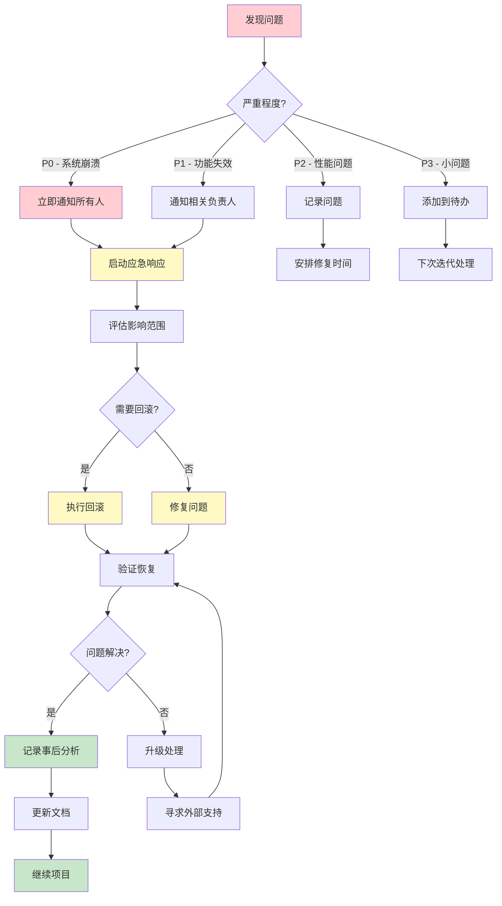

# 风险评估和应对策略

## 风险等级定义

- **高风险** 🔴: 可能导致项目失败或数据丢失
- **中风险** 🟡: 可能导致延期或功能受限
- **低风险** 🟢: 影响较小，易于解决

## 风险清单

### 1. 数据迁移风险 🔴 高风险

**风险描述：**
- 数据迁移过程中可能出现数据丢失
- 数据格式转换错误导致数据损坏
- 关联关系断裂

**影响：**
- 历史数据丢失
- 业务无法正常运行
- 需要重新迁移

**应对策略：**
1. **预防措施：**
   - 在迁移前完整备份所有 LocalStorage 数据
   - 使用事务确保数据一致性
   - 分批次迁移，每批验证后再继续
   - 编写详细的数据验证脚本

2. **检测方法：**
   - 对比源数据和目标数据的记录数
   - 抽样检查数据准确性
   - 验证所有外键关系
   - 运行数据完整性测试

3. **回滚方案：**
   ```sql
   -- 回滚脚本
   BEGIN;
   -- 删除新导入的数据
   TRUNCATE TABLE customers CASCADE;
   TRUNCATE TABLE training_sessions CASCADE;
   -- 从备份恢复
   INSERT INTO customers SELECT * FROM backup_customers;
   INSERT INTO training_sessions SELECT * FROM backup_training_sessions;
   COMMIT;
   ```

4. **责任人：** 开发负责人
5. **检查点：** Phase 7 每个步骤后

---

### 2. 认证系统迁移风险 🔴 高风险

**风险描述：**
- 用户无法登录
- Session 管理出错
- 权限控制失效

**影响：**
- 所有用户无法访问系统
- 数据安全风险
- 业务中断

**应对策略：**
1. **预防措施：**
   - 保留旧的认证代码作为备份
   - 使用功能开关（feature flag）逐步切换
   - 在测试环境充分测试
   - 准备降级方案

2. **检测方法：**
   - 测试所有角色的登录
   - 验证 token 刷新机制
   - 测试权限检查逻辑
   - 监控认证失败率

3. **降级方案：**
   ```typescript
   // 使用功能开关
   const USE_SUPABASE_AUTH = import.meta.env.VITE_USE_SUPABASE_AUTH === 'true';
   
   if (USE_SUPABASE_AUTH) {
     // 使用 Supabase 认证
     await supabaseService.signIn(email, password);
   } else {
     // 降级到 LocalStorage 认证
     await localAuthService.login(username, password);
   }
   ```

4. **责任人：** 前端开发负责人
5. **检查点：** Phase 4 完成后

---

### 3. RLS 策略配置错误 🔴 高风险

**风险描述：**
- 业务员能看到其他人的客户
- 未授权用户能访问敏感数据
- 数据泄露风险

**影响：**
- 严重的安全漏洞
- 违反数据隐私要求
- 客户信任度下降

**应对策略：**
1. **预防措施：**
   - 仔细审查每个 RLS 策略
   - 使用最小权限原则
   - 在测试环境验证所有权限场景
   - 进行安全审计

2. **检测方法：**
   ```sql
   -- 测试脚本：验证业务员只能看到自己的客户
   SET LOCAL ROLE authenticated;
   SET LOCAL request.jwt.claims.sub TO 'salesperson-user-id';
   
   SELECT * FROM customers;
   -- 应该只返回该业务员的客户
   ```

3. **测试清单：**
   - [ ] 管理员可以查看所有数据
   - [ ] 业务员只能查看自己的客户
   - [ ] 业务员不能修改其他人的客户
   - [ ] 专家只能查看自己的培训
   - [ ] 未认证用户无法访问任何数据

4. **责任人：** 后端/数据库负责人
5. **检查点：** Phase 1 和 Phase 8

---

### 4. 性能问题 🟡 中风险

**风险描述：**
- 页面加载缓慢
- 数据库查询超时
- 实时订阅延迟

**影响：**
- 用户体验差
- 系统响应慢
- 可能需要重新优化

**应对策略：**
1. **预防措施：**
   - 提前添加数据库索引
   - 实现分页加载
   - 使用缓存机制
   - 优化查询语句

2. **性能基准：**
   - 页面首次加载 < 3 秒
   - API 响应时间 < 500ms
   - 实时更新延迟 < 1 秒
   - 支持 100+ 并发用户

3. **监控指标：**
   ```typescript
   // 性能监控
   const startTime = performance.now();
   const data = await supabaseService.getCustomers();
   const endTime = performance.now();
   
   if (endTime - startTime > 500) {
     logger.warn('Slow query detected', {
       duration: endTime - startTime,
       query: 'getCustomers'
     });
   }
   ```

4. **优化方案：**
   - 添加更多索引
   - 实现查询结果缓存
   - 使用 CDN 加速静态资源
   - 优化数据库连接池

5. **责任人：** 性能优化负责人
6. **检查点：** Phase 6 和 Phase 8

---

### 5. 实时同步问题 🟡 中风险

**风险描述：**
- 实时更新不工作
- 数据不同步
- WebSocket 连接频繁断开

**影响：**
- 用户看到过期数据
- 多用户协作困难
- 需要手动刷新页面

**应对策略：**
1. **预防措施：**
   - 实现自动重连机制
   - 添加心跳检测
   - 提供手动刷新选项
   - 使用轮询作为降级方案

2. **实现示例：**
   ```typescript
   class RealtimeManager {
     private subscription: RealtimeChannel | null = null;
     private reconnectAttempts = 0;
     private maxReconnectAttempts = 5;
     
     subscribe(callback: Function) {
       this.subscription = supabase
         .channel('changes')
         .on('postgres_changes', { event: '*', schema: 'public' }, callback)
         .subscribe((status) => {
           if (status === 'SUBSCRIBED') {
             this.reconnectAttempts = 0;
           } else if (status === 'CLOSED') {
             this.handleReconnect();
           }
         });
     }
     
     handleReconnect() {
       if (this.reconnectAttempts < this.maxReconnectAttempts) {
         this.reconnectAttempts++;
         setTimeout(() => this.subscribe(), 1000 * this.reconnectAttempts);
       } else {
         // 降级到轮询
         this.startPolling();
       }
     }
     
     startPolling() {
       setInterval(() => {
         // 定期获取最新数据
         this.fetchLatestData();
       }, 5000);
     }
   }
   ```

3. **测试方法：**
   - 断开网络连接测试
   - 长时间连接稳定性测试
   - 多客户端同时更新测试

4. **责任人：** 前端开发负责人
5. **检查点：** Phase 5 和 Phase 8

---

### 6. 环境变量泄露 🟡 中风险

**风险描述：**
- API Key 被提交到 Git
- 环境变量配置错误
- 生产环境使用测试配置

**影响：**
- 安全漏洞
- 未授权访问
- 数据泄露风险

**应对策略：**
1. **预防措施：**
   - 将 .env.local 添加到 .gitignore
   - 使用 .env.example 作为模板
   - 在 CI/CD 中验证环境变量
   - 定期轮换 API Key

2. **检查清单：**
   ```bash
   # 检查是否有敏感信息被提交
   git log -p | grep -i "supabase"
   git log -p | grep -i "api_key"
   
   # 检查 .gitignore
   cat .gitignore | grep ".env"
   ```

3. **环境变量验证：**
   ```typescript
   // 启动时验证
   function validateEnv() {
     const required = [
       'VITE_SUPABASE_URL',
       'VITE_SUPABASE_ANON_KEY'
     ];
     
     const missing = required.filter(key => !import.meta.env[key]);
     
     if (missing.length > 0) {
       throw new Error(`Missing environment variables: ${missing.join(', ')}`);
     }
     
     // 验证格式
     if (!import.meta.env.VITE_SUPABASE_URL.startsWith('https://')) {
       throw new Error('Invalid SUPABASE_URL format');
     }
   }
   ```

4. **责任人：** DevOps/安全负责人
5. **检查点：** Phase 2 和 Phase 9

---

### 7. 部署失败 🟡 中风险

**风险描述：**
- Netlify 构建失败
- 环境变量未正确配置
- 依赖版本冲突

**影响：**
- 无法上线
- 项目延期
- 需要重新配置

**应对策略：**
1. **预防措施：**
   - 在本地测试生产构建
   - 锁定依赖版本
   - 使用 Netlify 预览部署
   - 准备详细的部署文档

2. **本地验证：**
   ```bash
   # 本地测试生产构建
   pnpm build
   
   # 检查构建产物
   ls -la dist/static
   
   # 本地预览
   pnpm preview
   ```

3. **Netlify 配置检查：**
   ```toml
   # netlify.toml
   [build]
     command = "pnpm build"
     publish = "dist/static"
   
   [build.environment]
     NODE_VERSION = "18"
     PNPM_VERSION = "8"
   
   [[redirects]]
     from = "/*"
     to = "/index.html"
     status = 200
   ```

4. **常见问题排查：**
   - 检查 Node.js 版本
   - 检查依赖安装
   - 检查构建命令
   - 检查环境变量
   - 检查发布目录路径

5. **责任人：** DevOps 负责人
6. **检查点：** Phase 9

---

### 8. 向后兼容性问题 🟢 低风险

**风险描述：**
- UI 变化导致用户困惑
- 操作流程改变
- 功能缺失

**影响：**
- 用户体验下降
- 需要用户培训
- 用户投诉增加

**应对策略：**
1. **预防措施：**
   - 保持 UI 完全一致
   - 保持操作流程不变
   - 确保所有功能都实现
   - 提供用户指南

2. **UI 对比检查：**
   - [ ] 登录页面布局一致
   - [ ] 仪表盘布局一致
   - [ ] 客户管理界面一致
   - [ ] 培训管理界面一致
   - [ ] 所有按钮和菜单位置一致

3. **功能对比检查：**
   - [ ] 所有 CRUD 操作正常
   - [ ] 搜索和过滤功能正常
   - [ ] 数据导出功能正常
   - [ ] 权限控制正常

4. **责任人：** 产品负责人
5. **检查点：** Phase 5 和 Phase 12

---

### 9. 数据库连接问题 🟢 低风险

**风险描述：**
- 网络不稳定
- Supabase 服务中断
- 连接池耗尽

**影响：**
- 临时无法访问
- 用户体验差
- 需要等待恢复

**应对策略：**
1. **预防措施：**
   - 实现自动重试机制
   - 添加友好的错误提示
   - 使用连接池
   - 监控服务状态

2. **重试机制：**
   ```typescript
   async function retryOperation<T>(
     operation: () => Promise<T>,
     maxRetries = 3,
     delay = 1000
   ): Promise<T> {
     for (let i = 0; i < maxRetries; i++) {
       try {
         return await operation();
       } catch (error) {
         if (i === maxRetries - 1) throw error;
         await new Promise(resolve => setTimeout(resolve, delay * (i + 1)));
       }
     }
     throw new Error('Max retries exceeded');
   }
   
   // 使用
   const data = await retryOperation(() => 
     supabaseService.getCustomers()
   );
   ```

3. **错误提示：**
   - "网络连接失败，请检查您的网络"
   - "服务暂时不可用，正在重试..."
   - "连接超时，请稍后再试"

4. **责任人：** 前端开发负责人
5. **检查点：** Phase 3 和 Phase 8

---

### 10. 测试覆盖不足 🟢 低风险

**风险描述：**
- 某些功能未测试
- 边界情况未覆盖
- 回归问题

**影响：**
- 上线后发现 bug
- 需要紧急修复
- 用户体验受影响

**应对策略：**
1. **预防措施：**
   - 制定详细的测试计划
   - 使用测试清单
   - 进行代码审查
   - 自动化测试

2. **测试清单：**
   ```markdown
   ## 功能测试
   - [ ] 用户登录
   - [ ] 用户登出
   - [ ] 客户列表查看
   - [ ] 客户添加
   - [ ] 客户编辑
   - [ ] 客户删除
   - [ ] 培训场次管理
   - [ ] 权限控制
   
   ## 边界测试
   - [ ] 空数据情况
   - [ ] 大数据量情况
   - [ ] 网络断开情况
   - [ ] 并发操作情况
   
   ## 兼容性测试
   - [ ] Chrome 浏览器
   - [ ] Firefox 浏览器
   - [ ] Safari 浏览器
   - [ ] Edge 浏览器
   - [ ] 移动端浏览器
   ```

3. **责任人：** QA 负责人
4. **检查点：** Phase 8

---

## 风险监控仪表板

```typescript
// 风险监控指标
interface RiskMetrics {
  // 数据完整性
  dataIntegrity: {
    recordCount: number;
    missingRecords: number;
    brokenRelations: number;
  };
  
  // 性能指标
  performance: {
    avgPageLoadTime: number;
    avgApiResponseTime: number;
    slowQueriesCount: number;
  };
  
  // 安全指标
  security: {
    authFailureRate: number;
    unauthorizedAccessAttempts: number;
    rlsPolicyViolations: number;
  };
  
  // 可用性指标
  availability: {
    uptime: number;
    errorRate: number;
    connectionFailures: number;
  };
}

// 风险评分
function calculateRiskScore(metrics: RiskMetrics): number {
  let score = 100;
  
  // 数据完整性扣分
  score -= metrics.dataIntegrity.missingRecords * 10;
  score -= metrics.dataIntegrity.brokenRelations * 5;
  
  // 性能扣分
  if (metrics.performance.avgPageLoadTime > 3000) score -= 10;
  if (metrics.performance.avgApiResponseTime > 500) score -= 10;
  
  // 安全扣分
  score -= metrics.security.unauthorizedAccessAttempts * 5;
  score -= metrics.security.rlsPolicyViolations * 20;
  
  // 可用性扣分
  if (metrics.availability.uptime < 0.99) score -= 20;
  if (metrics.availability.errorRate > 0.01) score -= 10;
  
  return Math.max(0, score);
}
```

## 应急联系人

| 角色 | 职责 | 联系方式 |
|------|------|----------|
| 项目负责人 | 整体协调 | [联系方式] |
| 开发负责人 | 技术决策 | [联系方式] |
| 数据库负责人 | 数据安全 | [联系方式] |
| DevOps 负责人 | 部署运维 | [联系方式] |
| QA 负责人 | 质量保证 | [联系方式] |

## 应急响应流程



## 总结

通过系统的风险识别、评估和应对策略，我们可以：

1. **提前预防** - 在问题发生前采取预防措施
2. **快速检测** - 及时发现问题
3. **有效应对** - 有明确的解决方案
4. **持续改进** - 从问题中学习

关键成功因素：
- ✅ 完整的备份策略
- ✅ 详细的测试计划
- ✅ 清晰的回滚方案
- ✅ 有效的监控机制
- ✅ 快速的响应流程
