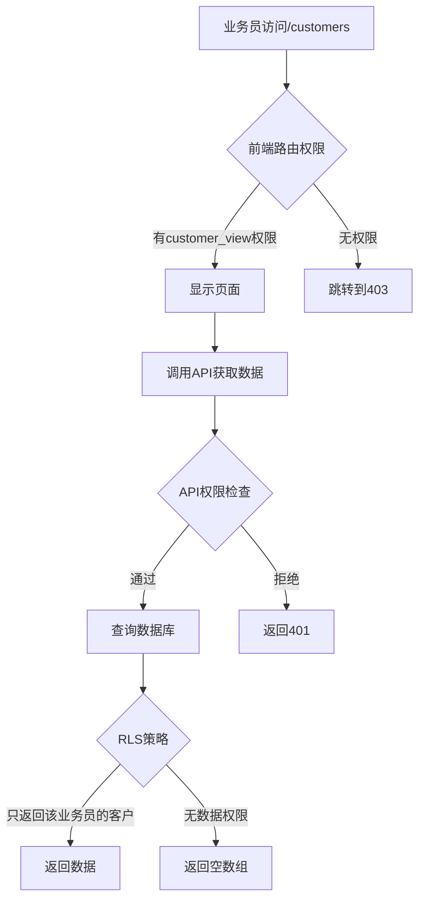
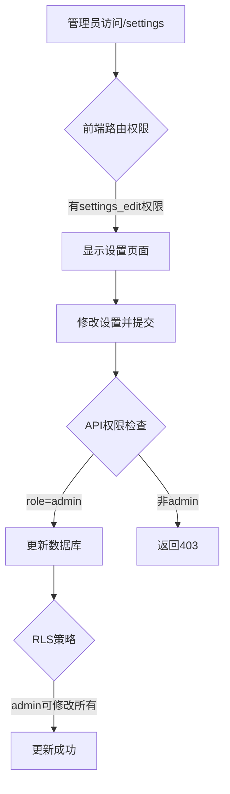

# 权限系统三层架构详解

> 最后更新：2025-11-07
> 
> 本文档详细说明系统的三层权限架构：前端路由权限、API权限、数据库RLS权限

## 🏗️ 权限架构总览

```
用户请求
    ↓
[第一层] 前端路由权限 (React Router)
    ↓ 通过
[第二层] API权限检查 (Supabase Functions/API)
    ↓ 通过
[第三层] RLS行级安全 (PostgreSQL Policies)
    ↓ 通过
返回数据
```

## 🎯 第一层：前端路由权限

### 位置
- 文件：`src/contexts/AuthContext.tsx`
- 路由：`src/App.tsx` 
- 常量：`src/constants/permissions.ts`

### 控制内容
1. **页面访问**：用户能否访问某个页面
2. **菜单显示**：导航栏显示哪些菜单项
3. **功能按钮**：页面上的操作按钮是否显示

### 权限定义

#### 功能权限 (permissions)
```typescript
// src/constants/permissions.ts
export const PERMISSIONS = {
  // 客户管理权限
  CUSTOMER_VIEW: 'customer_view',          // 查看客户列表
  CUSTOMER_ADD: 'customer_add',            // 新增客户
  CUSTOMER_EDIT: 'customer_edit',          // 编辑客户
  CUSTOMER_DELETE: 'customer_delete',      // 删除客户
  CUSTOMER_EXPORT: 'customer_export',      // 导出客户
  CUSTOMER_IMPORT: 'customer_import',      // 导入客户
  
  // 培训管理权限
  TRAINING_VIEW: 'training_view',          // 查看培训
  TRAINING_ADD: 'training_add',            // 新增培训
  TRAINING_EDIT: 'training_edit',          // 编辑培训
  TRAINING_DELETE: 'training_delete',      // 删除培训
  TRAINING_ADD_PARTICIPANT: 'training_add_participant', // 添加参训人员
  
  // 专家管理权限
  EXPERT_VIEW: 'expert_view',              // 查看专家
  EXPERT_ADD: 'expert_add',                // 新增专家
  EXPERT_EDIT: 'expert_edit',              // 编辑专家
  EXPERT_DELETE: 'expert_delete',          // 删除专家
  
  // 业务员管理权限
  SALESPERSON_VIEW: 'salesperson_view',    // 查看业务员
  SALESPERSON_ADD: 'salesperson_add',      // 新增业务员
  SALESPERSON_EDIT: 'salesperson_edit',    // 编辑业务员
  SALESPERSON_DELETE: 'salesperson_delete',// 删除业务员
  
  // 招商简章权限
  PROSPECTUS_VIEW: 'prospectus_view',      // 查看简章
  PROSPECTUS_DOWNLOAD: 'prospectus_download', // 下载简章
  PROSPECTUS_ADD: 'prospectus_add',        // 新增简章
  PROSPECTUS_EDIT: 'prospectus_edit',      // 编辑简章
  PROSPECTUS_DELETE: 'prospectus_delete',  // 删除简章
  
  // 数据管理权限
  DATA_EXPORT: 'data_export',              // 导出数据
  DATA_IMPORT: 'data_import',              // 导入数据
  DATA_DOWNLOAD_TEMPLATE: 'data_download_template', // 下载模板
  
  // 系统设置权限
  SETTINGS_VIEW: 'settings_view',          // 查看设置
  SETTINGS_EDIT: 'settings_edit',          // 修改设置
  USER_MANAGE: 'user_manage',              // 用户管理
  ROLE_MANAGE: 'role_manage',              // 角色管理
  PERMISSION_MANAGE: 'permission_manage',  // 权限管理
};
```

#### 菜单功能权限 (menu_features)
```typescript
export const MENU_FEATURES = {
  dashboard: 'dashboard',                   // 仪表盘
  customer_management: 'customer_management', // 客户管理
  training_management: 'training_management', // 培训管理
  expert_management: 'expert_management',   // 专家管理
  salesperson_management: 'salesperson_management', // 业务员管理
  prospectus_management: 'prospectus_management', // 招商简章
  data_management: 'data_management',       // 数据管理
  sales_tracking: 'sales_tracking',         // 销售追踪
  training_performance: 'training_performance', // 培训业绩
  announcements: 'announcements',           // 公告通知
  profile_settings: 'profile_settings',     // 个人设置
  system_settings: 'system_settings',       // 系统设置
};
```

### 角色默认权限

#### Admin（管理员）
```javascript
// 拥有所有权限
permissions: Object.values(PERMISSIONS),
menu_features: Object.values(MENU_FEATURES)
```

#### Manager（业务经理）
```javascript
permissions: [
  // 查看权限
  PERMISSIONS.CUSTOMER_VIEW,
  PERMISSIONS.TRAINING_VIEW,
  PERMISSIONS.EXPERT_VIEW,
  PERMISSIONS.SALESPERSON_VIEW,
  PERMISSIONS.PROSPECTUS_VIEW,
  // 管理权限
  PERMISSIONS.CUSTOMER_ADD,
  PERMISSIONS.CUSTOMER_EDIT,
  PERMISSIONS.TRAINING_ADD,
  PERMISSIONS.TRAINING_EDIT,
  PERMISSIONS.TRAINING_ADD_PARTICIPANT,
  // 数据权限
  PERMISSIONS.DATA_EXPORT,
  PERMISSIONS.PROSPECTUS_DOWNLOAD,
],
menu_features: [
  MENU_FEATURES.dashboard,
  MENU_FEATURES.customer_management,
  MENU_FEATURES.training_management,
  MENU_FEATURES.salesperson_management,
  MENU_FEATURES.sales_tracking,
  MENU_FEATURES.training_performance,
  MENU_FEATURES.profile_settings,
]
```

#### Salesperson（业务员）
```javascript
permissions: [
  PERMISSIONS.CUSTOMER_VIEW,
  PERMISSIONS.CUSTOMER_ADD,
  PERMISSIONS.CUSTOMER_EDIT,
  PERMISSIONS.CUSTOMER_EXPORT,
  PERMISSIONS.CUSTOMER_IMPORT,
  PERMISSIONS.TRAINING_VIEW,
  PERMISSIONS.TRAINING_ADD_PARTICIPANT,
  PERMISSIONS.EXPERT_VIEW,
  PERMISSIONS.PROSPECTUS_VIEW,
  PERMISSIONS.PROSPECTUS_DOWNLOAD,
  PERMISSIONS.DATA_DOWNLOAD_TEMPLATE,
],
menu_features: [
  MENU_FEATURES.dashboard,
  MENU_FEATURES.customer_management,
  MENU_FEATURES.training_management,
  MENU_FEATURES.data_management,
  MENU_FEATURES.profile_settings,
]
```

#### Expert（专家）
```javascript
permissions: [
  PERMISSIONS.TRAINING_VIEW,
  PERMISSIONS.EXPERT_VIEW,
  PERMISSIONS.PROSPECTUS_VIEW,
  PERMISSIONS.PROSPECTUS_DOWNLOAD,
],
menu_features: [
  MENU_FEATURES.dashboard,
  MENU_FEATURES.training_management,
  MENU_FEATURES.profile_settings,
]
```

### 权限检查方法

```typescript
// 检查单个权限
const hasPermission = (permission: string): boolean => {
  return user?.permissions?.includes(permission) || false;
};

// 检查多个权限（任一满足）
const hasAnyPermission = (permissions: string[]): boolean => {
  return permissions.some(p => hasPermission(p));
};

// 检查菜单访问权限
const hasMenuAccess = (menuFeature: string): boolean => {
  return user?.menuAccess?.includes(menuFeature) || false;
};
```

## 🔒 第二层：API权限

### 位置
- Supabase Functions
- API路由处理
- 服务层函数

### 控制内容
1. **API访问**：用户能否调用某个API
2. **数据范围**：返回哪些数据
3. **操作限制**：允许的操作类型

### 实现方式

```typescript
// src/lib/supabase/supabaseService.ts
async function checkApiPermission(userId: string, requiredPermission: string) {
  const { data } = await supabase
    .from('user_permissions')
    .select('permission_id')
    .eq('user_id', userId)
    .eq('permission_id', requiredPermission)
    .single();
  
  return !!data;
}

// 使用示例
async createCustomer(customerData: any) {
  const user = await getCurrentUser();
  
  // API层权限检查
  if (!await checkApiPermission(user.id, 'customer_add')) {
    throw new Error('没有创建客户的权限');
  }
  
  // 继续执行创建逻辑...
}
```

## 🛡️ 第三层：RLS（Row Level Security）

### 位置
- PostgreSQL数据库
- Supabase RLS Policies

### 控制内容
1. **数据行访问**：用户能看到哪些数据行
2. **数据修改**：用户能修改哪些数据
3. **数据删除**：用户能删除哪些数据

### RLS策略示例

#### 1. 客户数据访问策略
```sql
-- 业务员只能看到自己的客户
CREATE POLICY "salesperson_own_customers" ON customers
FOR SELECT
USING (
  auth.uid() = salesperson_id 
  OR 
  EXISTS (
    SELECT 1 FROM user_profiles 
    WHERE id = auth.uid() 
    AND role IN ('admin', 'manager')
  )
);

-- 业务员只能修改自己的客户
CREATE POLICY "salesperson_update_own_customers" ON customers
FOR UPDATE
USING (auth.uid() = salesperson_id)
WITH CHECK (auth.uid() = salesperson_id);
```

#### 2. 培训参与者数据策略
```sql
-- 业务员只能看到自己成交的参训人员
CREATE POLICY "salesperson_own_participants" ON training_participants
FOR SELECT
USING (
  salesperson_name = (
    SELECT name FROM user_profiles WHERE id = auth.uid()
  )
  OR
  EXISTS (
    SELECT 1 FROM user_profiles 
    WHERE id = auth.uid() 
    AND role IN ('admin', 'manager')
  )
);
```

#### 3. 部门数据隔离
```sql
-- 经理只能看到本部门数据
CREATE POLICY "manager_department_data" ON training_participants
FOR SELECT
USING (
  EXISTS (
    SELECT 1 FROM user_profiles up1
    JOIN user_profiles up2 ON up2.name = training_participants.salesperson_name
    WHERE up1.id = auth.uid()
    AND up1.role = 'manager'
    AND up1.department_id = up2.department_id
  )
);
```

### RLS策略类型

| 策略类型 | SQL命令 | 说明 |
|---------|---------|------|
| SELECT | FOR SELECT | 控制数据读取 |
| INSERT | FOR INSERT | 控制数据插入 |
| UPDATE | FOR UPDATE | 控制数据更新 |
| DELETE | FOR DELETE | 控制数据删除 |
| ALL | FOR ALL | 控制所有操作 |

## 🔄 权限流程示例

### 场景1：业务员查看客户列表



### 场景2：管理员修改系统设置



## 📝 权限配置最佳实践

### 1. 最小权限原则
- 只授予必要的权限
- 定期审查权限分配
- 及时回收不需要的权限

### 2. 权限继承
```
Admin > Manager > Salesperson > Expert
```

### 3. 权限组合
- 查看权限是其他权限的前提
- 编辑权限包含查看权限
- 删除权限需要最高级别审批

### 4. 权限审计
```sql
-- 查看用户权限历史
SELECT 
  up.name,
  up.role,
  p.permission_id,
  p.granted_at
FROM user_permissions p
JOIN user_profiles up ON p.user_id = up.id
WHERE up.id = '用户ID'
ORDER BY p.granted_at DESC;
```

## 🚨 常见权限问题

### 问题1：权限不生效
**原因**：
- 前端缓存未更新
- 数据库权限未同步
- RLS策略配置错误

**解决**：
```javascript
// 强制刷新用户权限
await supabaseService.refreshUserPermissions();
```

### 问题2：越权访问
**原因**：
- 只依赖前端权限
- API层未校验
- RLS策略缺失

**解决**：
- 实施三层权限检查
- 添加审计日志

### 问题3：权限冲突
**原因**：
- 角色权限重叠
- 自定义权限与默认权限冲突

**解决**：
```sql
-- 检查权限冲突
SELECT 
  user_id,
  array_agg(DISTINCT permission_id) as permissions
FROM user_permissions
GROUP BY user_id
HAVING count(DISTINCT permission_id) != count(permission_id);
```

## 🔧 权限调试工具

### 1. 权限检查函数
```typescript
// src/utils/permissionDebug.ts
export function debugPermissions(user: User) {
  console.group('🔐 用户权限调试');
  console.log('用户ID:', user.id);
  console.log('角色:', user.role);
  console.log('功能权限:', user.permissions);
  console.log('菜单权限:', user.menuAccess);
  console.log('部门:', user.department);
  console.groupEnd();
}
```

### 2. RLS策略测试
```sql
-- 测试RLS策略
SET LOCAL "request.jwt.claims" = '{"sub": "用户UUID"}';
SELECT * FROM customers; -- 应该只返回该用户的数据
```

### 3. 权限矩阵报表
```sql
-- 生成权限矩阵
SELECT 
  r.role_name,
  p.permission_name,
  CASE WHEN rp.role_id IS NOT NULL THEN '✓' ELSE '✗' END as has_permission
FROM 
  (VALUES ('admin'), ('manager'), ('salesperson'), ('expert')) r(role_name)
CROSS JOIN 
  (SELECT DISTINCT permission_id as permission_name FROM user_permissions) p
LEFT JOIN role_permissions rp 
  ON r.role_name = rp.role_id 
  AND p.permission_name = rp.permission_id
ORDER BY r.role_name, p.permission_name;
```

## 📚 相关文档
- [数据库表结构与字段说明](./数据库表结构与字段说明.md)
- [默认权限配置](./业务员默认权限配置.md)
- [权限升级方案](./业务经理角色升级方案.md)

## 🔄 更新记录
- 2025-11-07：初始版本，详细说明三层权限架构
